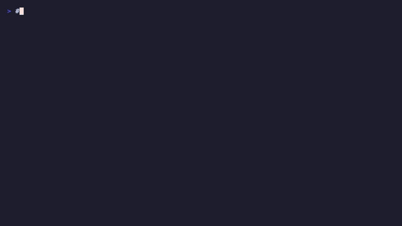
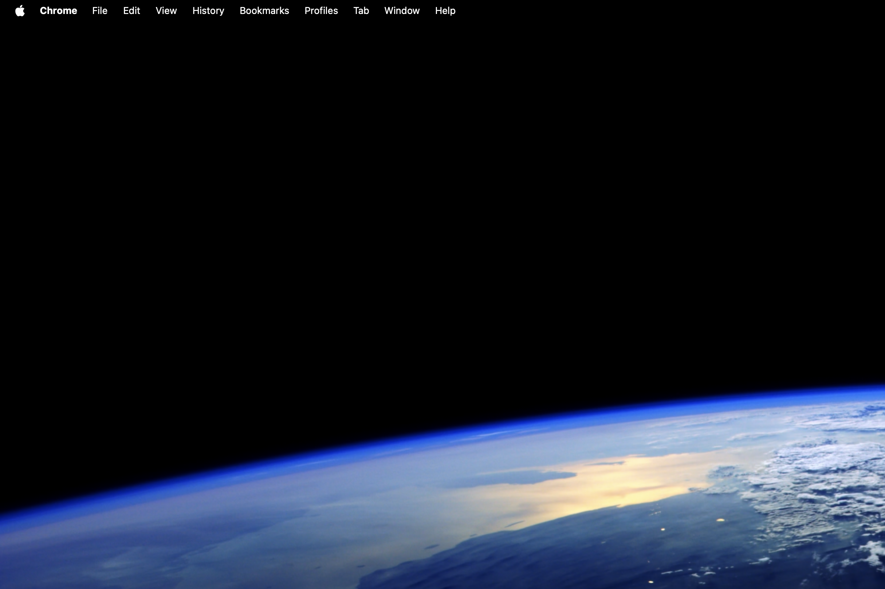
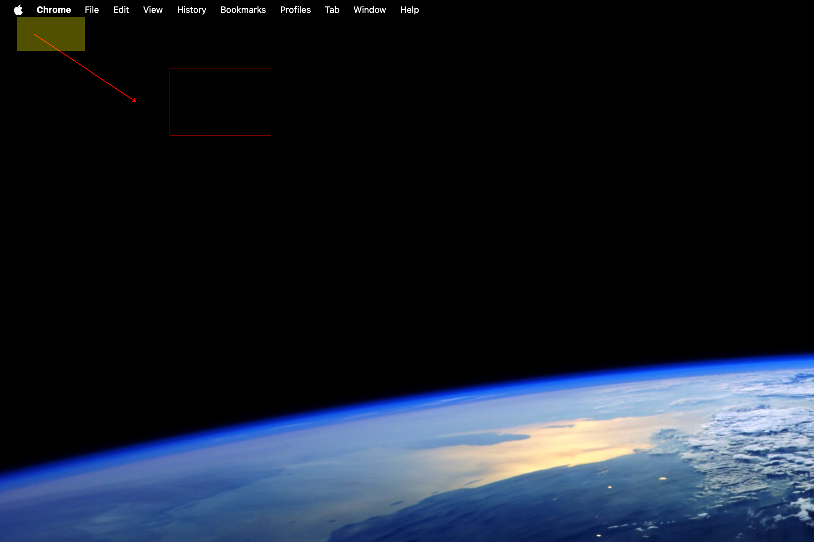
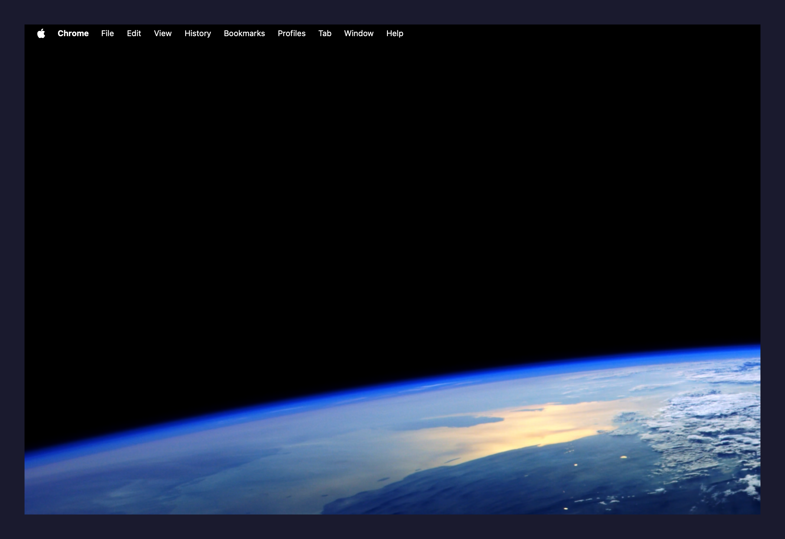

# ZigShot




A CleanShot X-inspired screenshot tool for macOS, built from scratch in Zig. Zero external dependencies — just Zig and macOS system frameworks.

## Screenshots

| Capture | Annotate | Background |
|---------|----------|------------|
|  |  |  |

## What it does

- **Screen capture** — fullscreen, area selection, or specific window by title
- **Annotations** — arrows, rectangles, blur/redact regions, highlights, text
- **Background** — padding, colors, gradients, rounded corners, drop shadows
- **Screen recording** — MP4 or GIF, region or fullscreen
- **OCR** — extract text from screenshots via Apple Vision (on-device, no cloud)
- **Hotkeys** — global keyboard shortcuts (Cmd+Shift+3/4/5)
- **Menu bar app** — lives in your menu bar with quick-access overlay
- **Clipboard** — copy captures directly, no file needed

## Quick start

```bash
# Build
zig build

# Capture fullscreen to clipboard
zig build run

# Capture to file
zig build run -- capture --fullscreen -o screenshot.png

# Capture a region
zig build run -- capture --area 100,200,800,600 -o area.png

# Capture a window by title
zig build run -- capture --window "Safari" -o safari.png

# Annotate an image
zig build run -- annotate shot.png --arrow 10,10,200,200 --blur 300,100,150,80

# Add background with gradient
zig build run -- bg shot.png --gradient ocean --radius 12 --shadow

# Add background with solid color
zig build run -- bg shot.png --padding 64 --color "#1a1a2e"

# Record screen (MP4)
zig build run -- record --area 0,0,800,600 -o screen.mp4 --duration 10

# Record as GIF
zig build run -- record --gif --fps 10 -o demo.gif

# Extract text (OCR)
zig build run -- ocr screenshot.png

# Launch menu bar app
zig build run -- gui

# Run tests
zig build test
```

## Architecture

```
src/
├── main.zig                Entry point, command dispatch
├── root.zig                Library root (barrel exports)
├── cli/
│   └── args.zig            CLI argument parser
├── core/                   Pure Zig — no OS dependencies
│   ├── image.zig           RGBA pixel buffer (the central type)
│   ├── geometry.zig        Point, Size, Rect
│   ├── annotation.zig      Annotation data model
│   ├── blur.zig            Gaussian blur for redaction
│   └── pipeline.zig        Crop, pad, draw, composite, gradients
└── platform/               macOS-specific (CoreGraphics, Vision, AppKit)
    ├── capture.zig          Screen capture via CGWindowListCreateImage
    ├── clipboard.zig        Clipboard via osascript
    ├── ocr.zig              OCR via Swift/Vision subprocess
    ├── hotkey.zig           Global hotkeys via CGEventTap
    ├── overlay.zig          Selection overlay + menu bar app
    ├── quick_overlay.zig    Post-capture quick actions panel
    ├── editor.zig           Interactive annotation editor
    └── recording.zig        Screen recording via ScreenCaptureKit
vendor/
├── appkit_bridge.h          ObjC bridge header (C API for AppKit)
└── appkit_bridge.m          ObjC bridge implementation
```

**Three layers:**
- **CLI** parses arguments and dispatches commands
- **Platform** wraps macOS C APIs (`@cImport` of CoreGraphics, ImageIO, AppKit bridge)
- **Core** is pure Zig with zero OS deps — fully testable on any platform

## Requirements

- macOS 13+ (Ventura)
- Zig 0.15.x
- Screen Recording permission (for capture)
- Input Monitoring permission (for hotkeys)

## Learning resource

The codebase is heavily commented for developers learning Zig — especially those coming from JavaScript. Every file has architecture context, JS analogies, and explanations of Zig-specific patterns (allocators, error unions, C interop, `defer`/`errdefer`). Start reading at `src/root.zig`.

## Commits

This project uses [Conventional Commits](https://www.conventionalcommits.org/):

```
feat:     New feature
fix:      Bug fix
docs:     Documentation only
refactor: Code change that neither fixes a bug nor adds a feature
test:     Adding or updating tests
chore:    Build process, CI, tooling
```

## License

MIT
