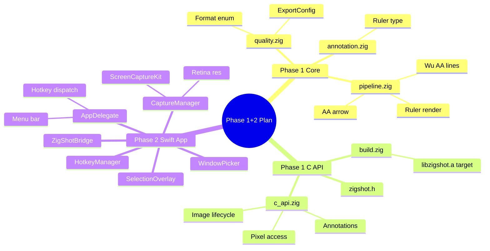

# ZigShot Native Redesign — Phase 1+2 Implementation Plan

> **For agentic workers:** REQUIRED SUB-SKILL: Use superpowers:subagent-driven-development (recommended) or superpowers:executing-plans to implement this plan task-by-task. Steps use checkbox (`- [ ]`) syntax for tracking.

**Goal:** Build a clean C API for the Zig core library (`libzigshot.a`) with anti-aliased rendering and quality metadata, then create a native Swift macOS app that captures screenshots via ScreenCaptureKit at full Retina resolution.

**Architecture:** Zig core compiles to a static C library with exported functions. Swift app links the library and calls it via a C bridging header. ScreenCaptureKit handles capture, AppKit handles GUI, Zig handles pixel processing, ImageIO handles export encoding with DPI/ICC metadata.

**Tech Stack:** Zig 0.15.2 (core), Swift 5.9+ (macOS app), macOS 14+ SDK, ScreenCaptureKit, AppKit, ImageIO

---

## Context



**Dependency graph:** Tasks 1-3 are independent (different files). Task 4 depends on 1-3. Tasks 5-6 depend on 4. Tasks 7-12 are sequential and depend on 6.

For subagent execution: Tasks 1, 2, 3 can run in parallel. Everything else is sequential.

---

## File Structure

### New Files
| File | Purpose |
|------|---------|
| `src/core/quality.zig` | ExportConfig struct, Format enum |
| `src/core/c_api.zig` | C-callable API surface for Swift FFI |
| `include/zigshot.h` | C header for libzigshot consumers |
| `app/Package.swift` | SPM package manifest |
| `app/Sources/CZigShot/include/module.modulemap` | Clang module map for C header |
| `app/Sources/CZigShot/include/zigshot.h` | Header copy for SPM |
| `app/Sources/ZigShot/main.swift` | App entry point |
| `app/Sources/ZigShot/AppDelegate.swift` | Menu bar app, permission handling |
| `app/Sources/ZigShot/ZigShotBridge.swift` | Swift wrapper around C API |
| `app/Sources/ZigShot/CaptureManager.swift` | ScreenCaptureKit capture |
| `app/Sources/ZigShot/SelectionOverlay.swift` | Area selection overlay |
| `app/Sources/ZigShot/WindowPicker.swift` | Window picker menu |
| `app/Sources/ZigShot/HotkeyManager.swift` | Global hotkey registration |

### Modified Files
| File | Change |
|------|--------|
| `src/core/annotation.zig:22-128` | Add `ruler` variant to Annotation union |
| `src/core/pipeline.zig` | Add `drawLineAA`, `drawArrowAA`, `drawRuler` |
| `src/root.zig:29-47` | Export `quality` and `c_api` modules |
| `build.zig:9-99` | Add static library target + header install |

---

## Phase 1: Core Quality & C API

### Task 1: ExportConfig types

**Files:**
- Create: `src/core/quality.zig`

- [ ] **Step 1: Write quality.zig**

```zig
//! Export quality and format configuration.
//!
//! These types define HOW an image gets exported — format, quality level,
//! DPI, and color profile embedding. On macOS, Swift reads these values
//! and passes them to ImageIO. On Linux (future), Zig-native encoders
//! will consume them directly.

const std = @import("std");

/// Supported export formats.
pub const Format = enum {
    png,
    jpeg,
    webp,
    tiff,
    heif,
};

/// Configuration for image export.
///
/// Smart defaults: PNG at 144 DPI with sRGB ICC profile.
/// Quality field only applies to lossy formats (JPEG, WebP, lossy HEIF).
pub const ExportConfig = struct {
    format: Format = .png,
    /// 0.0 (worst) to 1.0 (best). Only used for lossy formats.
    quality: f32 = 0.92,
    /// Dots per inch. 72 = 1x, 144 = 2x Retina, 216 = 3x.
    dpi: u32 = 144,
    /// Embed sRGB ICC color profile in output.
    embed_color_profile: bool = true,
    /// Strip EXIF/location metadata for privacy.
    strip_metadata: bool = false,
};

// ============================================================================
// Tests
// ============================================================================

test "ExportConfig: defaults are sane" {
    const config = ExportConfig{};
    try std.testing.expectEqual(Format.png, config.format);
    try std.testing.expectApproxEqAbs(@as(f32, 0.92), config.quality, 0.001);
    try std.testing.expectEqual(@as(u32, 144), config.dpi);
    try std.testing.expect(config.embed_color_profile);
    try std.testing.expect(!config.strip_metadata);
}

test "ExportConfig: custom JPEG config" {
    const config = ExportConfig{
        .format = .jpeg,
        .quality = 0.85,
        .dpi = 72,
        .strip_metadata = true,
    };
    try std.testing.expectEqual(Format.jpeg, config.format);
    try std.testing.expectApproxEqAbs(@as(f32, 0.85), config.quality, 0.001);
    try std.testing.expectEqual(@as(u32, 72), config.dpi);
    try std.testing.expect(config.strip_metadata);
}

test "Format: all variants exist" {
    // Compile-time check that all expected variants are present
    const formats = [_]Format{ .png, .jpeg, .webp, .tiff, .heif };
    try std.testing.expectEqual(@as(usize, 5), formats.len);
}
```

- [ ] **Step 2: Verify compilation**

Run: `cd /Users/s3nik/Desktop/zigshot && zig build-lib src/core/quality.zig 2>&1 | head -5`
Expected: No errors (clean compilation).

Run: `cd /Users/s3nik/Desktop/zigshot && zig test src/core/quality.zig`
Expected: All 3 tests pass.

- [ ] **Step 3: Commit**

```bash
git add src/core/quality.zig
git commit -m "feat(core): add ExportConfig and Format types for quality metadata"
```

---

### Task 2: Ruler annotation type

**Files:**
- Modify: `src/core/annotation.zig:22-128`

- [ ] **Step 1: Write failing test for ruler bounds**

Add to the test section of `src/core/annotation.zig`:

```zig
test "Annotation: ruler bounds" {
    const ruler = Annotation{ .ruler = .{
        .start = .{ .x = 50, .y = 100 },
        .end = .{ .x = 200, .y = 100 },
    } };
    const b = ruler.bounds();
    try std.testing.expectEqual(@as(i32, 50), b.x);
    try std.testing.expectEqual(@as(i32, 100), b.y);
    try std.testing.expectEqual(@as(u32, 150), b.width);
    try std.testing.expectEqual(@as(u32, 0), b.height);
}
```

- [ ] **Step 2: Run test to verify it fails**

Run: `cd /Users/s3nik/Desktop/zigshot && zig test src/core/annotation.zig 2>&1 | tail -5`
Expected: Compilation error (no `ruler` variant).

- [ ] **Step 3: Add Ruler struct and variant**

In `src/core/annotation.zig`, add after the `numbering` field (line 30) inside the `Annotation` union:

```zig
    ruler: Ruler,
```

Add the Ruler struct after the Numbering struct (after line 88):

```zig
    pub const Ruler = struct {
        start: Point,
        end: Point,
        color: Color = Color{ .r = 0, .g = 200, .b = 255, .a = 255 }, // cyan
        width: f32 = 1.0,
        tick_size: f32 = 6.0,
    };
```

- [ ] **Step 4: Add ruler case to bounds()**

In the `bounds()` function (after the `.numbering` case, before the closing `};`):

```zig
            .ruler => |r| {
                const min_x = @min(r.start.x, r.end.x);
                const min_y = @min(r.start.y, r.end.y);
                const max_x = @max(r.start.x, r.end.x);
                const max_y = @max(r.start.y, r.end.y);
                return Rect{
                    .x = min_x,
                    .y = min_y,
                    .width = @intCast(max_x - min_x),
                    .height = @intCast(max_y - min_y),
                };
            },
```

- [ ] **Step 5: Run tests**

Run: `cd /Users/s3nik/Desktop/zigshot && zig test src/core/annotation.zig`
Expected: All tests pass (including new ruler bounds test).

- [ ] **Step 6: Commit**

```bash
git add src/core/annotation.zig
git commit -m "feat(core): add ruler annotation type for pixel measurement"
```

---

### Task 3: Anti-aliased line rendering

**Files:**
- Modify: `src/core/pipeline.zig`

- [ ] **Step 1: Write failing test for drawLineAA**

Add to the test section of `src/core/pipeline.zig`:

```zig
test "drawLineAA: anti-aliased diagonal has intermediate alpha" {
    const allocator = std.testing.allocator;
    var img = try Image.init(allocator, 20, 20);
    defer img.deinit();
    img.fill(Color.white);

    drawLineAA(&img, 0, 0, 19, 10, Color.red, 1);

    // Anti-aliased line should have pixels with intermediate colors
    // (blended between red and white) — not just pure red or pure white
    var found_intermediate = false;
    var y: u32 = 0;
    while (y < 20) : (y += 1) {
        var x: u32 = 0;
        while (x < 20) : (x += 1) {
            const px = img.getPixel(x, y).?;
            if (px.r > 128 and px.r < 255 and px.g < 255) {
                found_intermediate = true;
            }
        }
    }
    try std.testing.expect(found_intermediate);
}
```

- [ ] **Step 2: Run test to verify it fails**

Run: `cd /Users/s3nik/Desktop/zigshot && zig test src/core/pipeline.zig 2>&1 | tail -5`
Expected: Compilation error (`drawLineAA` not found).

- [ ] **Step 3: Implement helper functions**

Add these private functions to `src/core/pipeline.zig` (after the `drawDot` function, before `drawArrow`):

```zig
/// Fractional part of a float (used by Wu's algorithm).
fn fpart(x: f64) f64 {
    return x - @floor(x);
}

/// Reverse fractional part: 1 - fpart(x).
fn rfpart(x: f64) f64 {
    return 1.0 - fpart(x);
}

/// Plot a pixel with fractional intensity (alpha modulation).
/// The brightness parameter (0.0-1.0) scales the color's alpha,
/// creating the anti-aliased effect — pixels near the geometric
/// line are brighter, pixels further away are dimmer.
fn plotAA(img: *Image, x: i32, y: i32, color: Color, brightness: f64) void {
    if (x < 0 or y < 0) return;
    const ux: u32 = @intCast(x);
    const uy: u32 = @intCast(y);
    if (ux >= img.width or uy >= img.height) return;

    const clamped = @max(@as(f64, 0), @min(@as(f64, 1), brightness));
    const a: u8 = @intFromFloat(@as(f64, @floatFromInt(color.a)) * clamped);
    if (a == 0) return;
    const fg = Color{ .r = color.r, .g = color.g, .b = color.b, .a = a };
    const bg = img.getPixel(ux, uy) orelse return;
    img.setPixel(ux, uy, Color.blend(fg, bg));
}
```

- [ ] **Step 4: Implement drawLineAA (Wu's algorithm)**

Add this public function to `src/core/pipeline.zig` (after the helper functions):

```zig
/// Draw an anti-aliased line using Wu's algorithm.
///
/// Wu's algorithm (1991) draws lines by plotting TWO pixels per step,
/// each with varying intensity based on sub-pixel position. Where
/// Bresenham's binary on/off produces jagged staircase edges, Wu's
/// smooth gradient edges look natural at any angle.
///
/// For thick lines (width > 2), falls back to Bresenham with dot stamps
/// since thickness already masks aliasing artifacts.
pub fn drawLineAA(img: *Image, x0: i32, y0: i32, x1: i32, y1: i32, color: Color, width: u32) void {
    // Thick lines: AA isn't visible, use fast Bresenham
    if (width > 2) {
        drawLine(img, x0, y0, x1, y1, color, width);
        return;
    }

    // Degenerate case
    if (x0 == x1 and y0 == y1) {
        plotAA(img, x0, y0, color, 1.0);
        return;
    }

    // Determine if line is steep (more vertical than horizontal)
    const steep = absI32(y1 - y0) > absI32(x1 - x0);

    // Transpose coordinates if steep so we always iterate along the longer axis
    var ax0 = if (steep) y0 else x0;
    var ay0 = if (steep) x0 else y0;
    var ax1 = if (steep) y1 else x1;
    var ay1 = if (steep) x1 else y1;

    // Ensure left-to-right
    if (ax0 > ax1) {
        std.mem.swap(i32, &ax0, &ax1);
        std.mem.swap(i32, &ay0, &ay1);
    }

    const dx: f64 = @floatFromInt(ax1 - ax0);
    const dy: f64 = @floatFromInt(ay1 - ay0);
    const gradient: f64 = if (dx == 0) 1.0 else dy / dx;

    // --- First endpoint ---
    var xend: f64 = @round(@as(f64, @floatFromInt(ax0)));
    var yend: f64 = @as(f64, @floatFromInt(ay0)) + gradient * (xend - @as(f64, @floatFromInt(ax0)));
    var xgap: f64 = rfpart(@as(f64, @floatFromInt(ax0)) + 0.5);
    const xpxl1: i32 = @intFromFloat(xend);
    const ypxl1: i32 = @intFromFloat(@floor(yend));

    if (steep) {
        plotAA(img, ypxl1, xpxl1, color, rfpart(yend) * xgap);
        plotAA(img, ypxl1 + 1, xpxl1, color, fpart(yend) * xgap);
    } else {
        plotAA(img, xpxl1, ypxl1, color, rfpart(yend) * xgap);
        plotAA(img, xpxl1, ypxl1 + 1, color, fpart(yend) * xgap);
    }

    var intery: f64 = yend + gradient;

    // --- Second endpoint ---
    xend = @round(@as(f64, @floatFromInt(ax1)));
    yend = @as(f64, @floatFromInt(ay1)) + gradient * (xend - @as(f64, @floatFromInt(ax1)));
    xgap = fpart(@as(f64, @floatFromInt(ax1)) + 0.5);
    const xpxl2: i32 = @intFromFloat(xend);
    const ypxl2: i32 = @intFromFloat(@floor(yend));

    if (steep) {
        plotAA(img, ypxl2, xpxl2, color, rfpart(yend) * xgap);
        plotAA(img, ypxl2 + 1, xpxl2, color, fpart(yend) * xgap);
    } else {
        plotAA(img, xpxl2, ypxl2, color, rfpart(yend) * xgap);
        plotAA(img, xpxl2, ypxl2 + 1, color, fpart(yend) * xgap);
    }

    // --- Main loop ---
    var x = xpxl1 + 1;
    while (x < xpxl2) : (x += 1) {
        const iy: i32 = @intFromFloat(@floor(intery));
        if (steep) {
            plotAA(img, iy, x, color, rfpart(intery));
            plotAA(img, iy + 1, x, color, fpart(intery));
        } else {
            plotAA(img, x, iy, color, rfpart(intery));
            plotAA(img, x, iy + 1, color, fpart(intery));
        }
        intery += gradient;
    }
}

/// Absolute value for i32. Avoids @abs which returns u32.
fn absI32(x: i32) i32 {
    return if (x < 0) -x else x;
}
```

- [ ] **Step 5: Run AA line test**

Run: `cd /Users/s3nik/Desktop/zigshot && zig test src/core/pipeline.zig`
Expected: New test passes alongside all existing tests.

- [ ] **Step 6: Write failing test for drawArrowAA**

Add to test section of `src/core/pipeline.zig`:

```zig
test "drawArrowAA: draws anti-aliased arrow" {
    const allocator = std.testing.allocator;
    var img = try Image.init(allocator, 100, 100);
    defer img.deinit();
    img.fill(Color.white);

    drawArrowAA(&img, 10, 10, 90, 50, Color.red, 2, 12.0);

    // Endpoint should have red pixels
    const px = img.getPixel(90, 50).?;
    try std.testing.expect(px.r > 200);
}
```

- [ ] **Step 7: Implement drawArrowAA**

Add after `drawLineAA` in `src/core/pipeline.zig`:

```zig
/// Draw an anti-aliased arrow. Same geometry as drawArrow,
/// but uses Wu's algorithm for smooth edges.
pub fn drawArrowAA(img: *Image, x0: i32, y0: i32, x1: i32, y1: i32, color: Color, line_width: u32, head_size: f32) void {
    // Draw the shaft
    drawLineAA(img, x0, y0, x1, y1, color, line_width);

    // Arrowhead geometry (identical to drawArrow)
    const fdx: f64 = @floatFromInt(x1 - x0);
    const fdy: f64 = @floatFromInt(y1 - y0);
    const len = @sqrt(fdx * fdx + fdy * fdy);
    if (len < 1.0) return;

    const nx = fdx / len;
    const ny = fdy / len;
    const hs: f64 = @floatCast(head_size);

    const ax1: i32 = x1 - @as(i32, @intFromFloat(hs * (nx * 0.866 + ny * 0.5)));
    const ay1: i32 = y1 - @as(i32, @intFromFloat(hs * (ny * 0.866 - nx * 0.5)));
    const ax2: i32 = x1 - @as(i32, @intFromFloat(hs * (nx * 0.866 - ny * 0.5)));
    const ay2: i32 = y1 - @as(i32, @intFromFloat(hs * (ny * 0.866 + nx * 0.5)));

    drawLineAA(img, x1, y1, ax1, ay1, color, line_width);
    drawLineAA(img, x1, y1, ax2, ay2, color, line_width);
}
```

- [ ] **Step 8: Write failing test for drawRuler**

Add to test section:

```zig
test "drawRuler: renders measurement line with ticks" {
    const allocator = std.testing.allocator;
    var img = try Image.init(allocator, 200, 100);
    defer img.deinit();

    drawRuler(&img, 20, 50, 180, 50, Color{ .r = 0, .g = 200, .b = 255, .a = 255 }, 1, 6);

    // Midpoint of ruler line should have cyan pixels
    const mid = img.getPixel(100, 50).?;
    try std.testing.expect(mid.b > 200);

    // Tick marks are perpendicular — for a horizontal line, ticks are vertical
    // Check tick at start point (x=20, y=44 and y=56 for tick_size=6)
    const tick_above = img.getPixel(20, 44).?;
    const tick_below = img.getPixel(20, 56).?;
    try std.testing.expect(tick_above.b > 100 or tick_below.b > 100);
}
```

- [ ] **Step 9: Implement drawRuler**

Add after `drawArrowAA`:

```zig
/// Draw a measurement ruler between two points.
/// Renders: main line + perpendicular tick marks at both endpoints.
/// Returns the pixel distance (for the GUI to display as text label).
pub fn drawRuler(img: *Image, x0: i32, y0: i32, x1: i32, y1: i32, color: Color, width: u32, tick_size: u32) void {
    // Main measurement line (anti-aliased)
    drawLineAA(img, x0, y0, x1, y1, color, width);

    // Compute perpendicular direction for tick marks
    const fdx: f64 = @floatFromInt(x1 - x0);
    const fdy: f64 = @floatFromInt(y1 - y0);
    const len = @sqrt(fdx * fdx + fdy * fdy);
    if (len < 1.0) return;

    const px = -fdy / len; // perpendicular x
    const py = fdx / len; // perpendicular y
    const ts: f64 = @floatFromInt(tick_size);

    // Start endpoint tick
    const sx0: i32 = x0 + @as(i32, @intFromFloat(px * ts));
    const sy0: i32 = y0 + @as(i32, @intFromFloat(py * ts));
    const sx1: i32 = x0 - @as(i32, @intFromFloat(px * ts));
    const sy1: i32 = y0 - @as(i32, @intFromFloat(py * ts));
    drawLineAA(img, sx0, sy0, sx1, sy1, color, width);

    // End endpoint tick
    const ex0: i32 = x1 + @as(i32, @intFromFloat(px * ts));
    const ey0: i32 = y1 + @as(i32, @intFromFloat(py * ts));
    const ex1: i32 = x1 - @as(i32, @intFromFloat(px * ts));
    const ey1: i32 = y1 - @as(i32, @intFromFloat(py * ts));
    drawLineAA(img, ex0, ey0, ex1, ey1, color, width);
}
```

- [ ] **Step 10: Run all tests**

Run: `cd /Users/s3nik/Desktop/zigshot && zig test src/core/pipeline.zig`
Expected: All tests pass (existing + 3 new).

- [ ] **Step 11: Commit**

```bash
git add src/core/pipeline.zig
git commit -m "feat(core): add Wu's anti-aliased line, AA arrow, and ruler rendering"
```

---

### Task 4: C API surface

**Files:**
- Create: `src/core/c_api.zig`

- [ ] **Step 1: Write c_api.zig**

```zig
//! C-callable API surface for libzigshot.
//!
//! This is the contract between the Zig core and platform GUI layers.
//! Swift (macOS) and GTK4 (Linux) call these functions via FFI.
//!
//! Design rules:
//! - All functions use C calling convention (export fn)
//! - Pointers are opaque to callers — never dereference a ZsImage* in C
//! - Colors are packed as 0xRRGGBBAA (big-endian RGBA in a u32)
//! - Memory is managed by the Zig allocator — callers create/destroy, never free

const std = @import("std");
const image_mod = @import("image.zig");
const pipeline = @import("pipeline.zig");
const blur_mod = @import("blur.zig");
const geometry = @import("geometry.zig");
const Image = image_mod.Image;
const Color = image_mod.Color;
const Rect = geometry.Rect;

/// The allocator backing all C API allocations.
/// c_allocator wraps malloc/free — always available on macOS/Linux.
const allocator = std.heap.c_allocator;

// ============================================================================
// Image lifecycle
// ============================================================================

/// Create a new image by copying raw RGBA pixels from an external buffer.
/// The source stride may differ from width*4 (e.g., CVPixelBuffer row alignment).
/// Returns null on allocation failure.
export fn zs_image_create(pixels: [*]const u8, width: u32, height: u32, stride: u32) ?*Image {
    const img_ptr = allocator.create(Image) catch return null;
    img_ptr.* = Image.init(allocator, width, height) catch {
        allocator.destroy(img_ptr);
        return null;
    };

    // Copy pixel data row by row (source stride may differ from dest stride)
    var y: u32 = 0;
    while (y < height) : (y += 1) {
        const src_offset = @as(usize, y) * @as(usize, stride);
        const dst_offset = @as(usize, y) * @as(usize, img_ptr.stride);
        const row_bytes = @as(usize, width) * 4;
        @memcpy(
            img_ptr.pixels[dst_offset .. dst_offset + row_bytes],
            pixels[src_offset .. src_offset + row_bytes],
        );
    }

    return img_ptr;
}

/// Create a new empty image (all pixels transparent black).
/// Returns null on allocation failure.
export fn zs_image_create_empty(width: u32, height: u32) ?*Image {
    const img_ptr = allocator.create(Image) catch return null;
    img_ptr.* = Image.init(allocator, width, height) catch {
        allocator.destroy(img_ptr);
        return null;
    };
    return img_ptr;
}

/// Free an image and its pixel buffer.
export fn zs_image_destroy(img: *Image) void {
    img.deinit();
    allocator.destroy(img);
}

// ============================================================================
// Pixel access
// ============================================================================

/// Get a mutable pointer to the raw RGBA pixel buffer.
/// Layout: row-major, 4 bytes per pixel (R, G, B, A).
/// The pointer is valid until zs_image_destroy is called.
export fn zs_image_get_pixels(img: *Image) [*]u8 {
    return img.pixels.ptr;
}

export fn zs_image_get_width(img: *Image) u32 {
    return img.width;
}

export fn zs_image_get_height(img: *Image) u32 {
    return img.height;
}

export fn zs_image_get_stride(img: *Image) u32 {
    return img.stride;
}

// ============================================================================
// Annotations
// ============================================================================

/// Draw an arrow from (x0,y0) to (x1,y1) with anti-aliased rendering.
export fn zs_annotate_arrow(img: *Image, x0: i32, y0: i32, x1: i32, y1: i32, color: u32, width: u32) void {
    pipeline.drawArrowAA(img, x0, y0, x1, y1, unpackColor(color), width, 12.0);
}

/// Draw a rectangle. If filled=true, fills the area; otherwise draws outline.
export fn zs_annotate_rect(img: *Image, x: i32, y: i32, w: u32, h: u32, color: u32, width: u32, filled: bool) void {
    const c = unpackColor(color);
    const rect = Rect.init(x, y, w, h);
    if (filled) {
        pipeline.fillRect(img, rect, c);
    } else {
        pipeline.strokeRect(img, rect, c, width);
    }
}

/// Blur a rectangular region for redaction.
export fn zs_annotate_blur(img: *Image, x: i32, y: i32, w: u32, h: u32, radius: u32) void {
    blur_mod.blurRegion(img, Rect.init(x, y, w, h), radius) catch {};
}

/// Draw a semi-transparent highlight overlay.
export fn zs_annotate_highlight(img: *Image, x: i32, y: i32, w: u32, h: u32, color: u32) void {
    pipeline.fillRect(img, Rect.init(x, y, w, h), unpackColor(color));
}

/// Draw an anti-aliased line.
export fn zs_annotate_line(img: *Image, x0: i32, y0: i32, x1: i32, y1: i32, color: u32, width: u32) void {
    pipeline.drawLineAA(img, x0, y0, x1, y1, unpackColor(color), width);
}

/// Draw a measurement ruler with tick marks. Returns the pixel distance.
export fn zs_annotate_ruler(img: *Image, x0: i32, y0: i32, x1: i32, y1: i32, color: u32, width: u32) f64 {
    pipeline.drawRuler(img, x0, y0, x1, y1, unpackColor(color), width, 6);
    const dx: f64 = @floatFromInt(x1 - x0);
    const dy: f64 = @floatFromInt(y1 - y0);
    return @sqrt(dx * dx + dy * dy);
}

/// Draw an ellipse outline inside the given rectangle.
export fn zs_annotate_ellipse(img: *Image, x: i32, y: i32, w: u32, h: u32, color: u32, width: u32) void {
    pipeline.drawEllipse(img, Rect.init(x, y, w, h), unpackColor(color), width);
}

// ============================================================================
// Internals
// ============================================================================

/// Unpack 0xRRGGBBAA into a Color struct.
fn unpackColor(rgba: u32) Color {
    return Color{
        .r = @intCast((rgba >> 24) & 0xFF),
        .g = @intCast((rgba >> 16) & 0xFF),
        .b = @intCast((rgba >> 8) & 0xFF),
        .a = @intCast(rgba & 0xFF),
    };
}

// ============================================================================
// Tests
// ============================================================================

test "c_api: image create empty and destroy" {
    const img = zs_image_create_empty(100, 50);
    try std.testing.expect(img != null);
    defer zs_image_destroy(img.?);

    try std.testing.expectEqual(@as(u32, 100), zs_image_get_width(img.?));
    try std.testing.expectEqual(@as(u32, 50), zs_image_get_height(img.?));
    try std.testing.expectEqual(@as(u32, 400), zs_image_get_stride(img.?));
}

test "c_api: image create from pixels copies data" {
    // Create a 2x2 red image
    var pixels = [_]u8{
        255, 0, 0, 255, 0, 255, 0, 255, // row 0: red, green
        0, 0, 255, 255, 255, 255, 255, 255, // row 1: blue, white
    };
    const img = zs_image_create(&pixels, 2, 2, 8);
    try std.testing.expect(img != null);
    defer zs_image_destroy(img.?);

    const out = zs_image_get_pixels(img.?);
    // Pixel (0,0) should be red
    try std.testing.expectEqual(@as(u8, 255), out[0]); // R
    try std.testing.expectEqual(@as(u8, 0), out[1]); // G
    try std.testing.expectEqual(@as(u8, 0), out[2]); // B
    try std.testing.expectEqual(@as(u8, 255), out[3]); // A
}

test "c_api: annotate arrow draws pixels" {
    const img = zs_image_create_empty(100, 100);
    try std.testing.expect(img != null);
    defer zs_image_destroy(img.?);

    // Draw red arrow (0xFF0000FF = red, fully opaque)
    zs_annotate_arrow(img.?, 10, 10, 90, 50, 0xFF0000FF, 2);

    // Endpoint should have non-zero pixels
    const out = zs_image_get_pixels(img.?);
    const stride = zs_image_get_stride(img.?);
    const offset = @as(usize, 50) * @as(usize, stride) + @as(usize, 90) * 4;
    try std.testing.expect(out[offset] > 0);
}

test "c_api: annotate blur modifies pixels" {
    const img = zs_image_create_empty(20, 20);
    try std.testing.expect(img != null);
    defer zs_image_destroy(img.?);

    // Set a single bright pixel
    const pixels = zs_image_get_pixels(img.?);
    const stride = zs_image_get_stride(img.?);
    const center = @as(usize, 10) * @as(usize, stride) + @as(usize, 10) * 4;
    pixels[center] = 255; // R
    pixels[center + 3] = 255; // A

    // Blur the region
    zs_annotate_blur(img.?, 0, 0, 20, 20, 3);

    // The bright pixel should have spread — neighbors should be non-zero
    const neighbor = @as(usize, 10) * @as(usize, stride) + @as(usize, 11) * 4;
    try std.testing.expect(pixels[neighbor] > 0);
}

test "c_api: ruler returns distance" {
    const img = zs_image_create_empty(200, 100);
    try std.testing.expect(img != null);
    defer zs_image_destroy(img.?);

    const dist = zs_annotate_ruler(img.?, 0, 0, 100, 0, 0x00C8FFFF, 1);
    try std.testing.expectApproxEqAbs(@as(f64, 100.0), dist, 0.001);
}

test "unpackColor: RGBA packing" {
    const c = unpackColor(0xFF8040C0);
    try std.testing.expectEqual(@as(u8, 0xFF), c.r);
    try std.testing.expectEqual(@as(u8, 0x80), c.g);
    try std.testing.expectEqual(@as(u8, 0x40), c.b);
    try std.testing.expectEqual(@as(u8, 0xC0), c.a);
}
```

- [ ] **Step 2: Verify compilation and tests**

Run: `cd /Users/s3nik/Desktop/zigshot && zig test src/core/c_api.zig`
Expected: All 6 tests pass.

- [ ] **Step 3: Commit**

```bash
git add src/core/c_api.zig
git commit -m "feat(core): add C-callable API surface for Swift/GTK FFI"
```

---

### Task 5: C header

**Files:**
- Create: `include/zigshot.h`

- [ ] **Step 1: Write zigshot.h**

```c
/**
 * zigshot.h — C API for libzigshot
 *
 * This header defines the public interface for the ZigShot image processing
 * library. Swift (macOS) and GTK4 (Linux) call these functions via FFI.
 *
 * Usage:
 *   1. Link against libzigshot.a
 *   2. #include "zigshot.h"
 *   3. Create images, apply annotations, read pixels back
 *
 * Memory: All ZsImage* handles are owned by libzigshot. Call
 * zs_image_destroy() when done. Never free() a ZsImage* directly.
 *
 * Colors: Packed as 0xRRGGBBAA (e.g., red = 0xFF0000FF).
 */

#ifndef ZIGSHOT_H
#define ZIGSHOT_H

#include <stdint.h>
#include <stdbool.h>

#ifdef __cplusplus
extern "C" {
#endif

/** Opaque image handle. Never dereference — only pass to zs_* functions. */
typedef struct ZsImage ZsImage;

/* ---- Image lifecycle ---- */

/** Create image from raw RGBA pixel buffer (copies data). Returns NULL on failure. */
ZsImage* zs_image_create(const uint8_t* pixels, uint32_t width, uint32_t height, uint32_t stride);

/** Create empty image (transparent black). Returns NULL on failure. */
ZsImage* zs_image_create_empty(uint32_t width, uint32_t height);

/** Free an image and its pixel buffer. */
void zs_image_destroy(ZsImage* img);

/* ---- Pixel access ---- */

/** Get mutable pointer to RGBA pixel data. Valid until zs_image_destroy(). */
uint8_t* zs_image_get_pixels(ZsImage* img);
uint32_t zs_image_get_width(ZsImage* img);
uint32_t zs_image_get_height(ZsImage* img);
uint32_t zs_image_get_stride(ZsImage* img);

/* ---- Annotations (color = 0xRRGGBBAA) ---- */

/** Draw anti-aliased arrow from (x0,y0) to (x1,y1). */
void zs_annotate_arrow(ZsImage* img, int32_t x0, int32_t y0, int32_t x1, int32_t y1, uint32_t color, uint32_t width);

/** Draw rectangle. filled=true fills area, false draws outline. */
void zs_annotate_rect(ZsImage* img, int32_t x, int32_t y, uint32_t w, uint32_t h, uint32_t color, uint32_t width, bool filled);

/** Blur rectangular region (for redaction). */
void zs_annotate_blur(ZsImage* img, int32_t x, int32_t y, uint32_t w, uint32_t h, uint32_t radius);

/** Draw semi-transparent highlight overlay. */
void zs_annotate_highlight(ZsImage* img, int32_t x, int32_t y, uint32_t w, uint32_t h, uint32_t color);

/** Draw anti-aliased line. */
void zs_annotate_line(ZsImage* img, int32_t x0, int32_t y0, int32_t x1, int32_t y1, uint32_t color, uint32_t width);

/** Draw measurement ruler with tick marks. Returns pixel distance. */
double zs_annotate_ruler(ZsImage* img, int32_t x0, int32_t y0, int32_t x1, int32_t y1, uint32_t color, uint32_t width);

/** Draw ellipse outline inside rectangle. */
void zs_annotate_ellipse(ZsImage* img, int32_t x, int32_t y, uint32_t w, uint32_t h, uint32_t color, uint32_t width);

#ifdef __cplusplus
}
#endif

#endif /* ZIGSHOT_H */
```

- [ ] **Step 2: Commit**

```bash
git add include/zigshot.h
git commit -m "feat(core): add C header for libzigshot API"
```

---

### Task 6: Build system + module updates

**Files:**
- Modify: `build.zig`
- Modify: `src/root.zig`

- [ ] **Step 1: Update root.zig to export new modules**

In `src/root.zig`, add after the existing core module imports (after line 34):

```zig
pub const quality = @import("core/quality.zig");
pub const c_api = @import("core/c_api.zig");
```

Add re-exports after the existing ones (after line 47):

```zig
pub const ExportConfig = quality.ExportConfig;
pub const Format = quality.Format;
```

- [ ] **Step 2: Add static library target to build.zig**

In `build.zig`, add after the `b.installArtifact(exe);` line (after line 71):

```zig
    // ---- Static C library (for Swift/GTK FFI consumers) ----
    // Compiles only the core modules (no platform code, no macOS deps).
    // Produces: zig-out/lib/libzigshot.a
    const static_lib = b.addStaticLibrary(.{
        .name = "zigshot",
        .root_source_file = b.path("src/core/c_api.zig"),
        .target = target,
        .optimize = optimize,
    });
    static_lib.linkLibC();
    b.installArtifact(static_lib);

    // Install C header alongside the library
    // Produces: zig-out/include/zigshot.h
    const install_header = b.addInstallFile(b.path("include/zigshot.h"), "include/zigshot.h");
    b.getInstallStep().dependOn(&install_header.step);
```

- [ ] **Step 3: Build and verify artifacts**

Run: `cd /Users/s3nik/Desktop/zigshot && zig build`
Expected: Clean build. Then verify:

Run: `ls -la zig-out/lib/libzigshot.a zig-out/include/zigshot.h`
Expected: Both files exist. `libzigshot.a` should be > 10KB.

- [ ] **Step 4: Run all tests**

Run: `cd /Users/s3nik/Desktop/zigshot && zig build test`
Expected: All tests pass (existing + new quality, annotation, pipeline, c_api tests).

- [ ] **Step 5: Commit**

```bash
git add build.zig src/root.zig
git commit -m "feat(build): add static library target and C header install"
```

---

## Phase 2: Swift App — Capture

### Task 7: Swift project scaffolding

**Files:**
- Create: `app/Package.swift`
- Create: `app/Sources/CZigShot/include/module.modulemap`
- Create: `app/Sources/CZigShot/include/zigshot.h`
- Create: `app/Sources/CZigShot/shim.c`
- Create: `app/Sources/ZigShot/main.swift`

- [ ] **Step 1: Create directory structure**

```bash
mkdir -p app/Sources/CZigShot/include
mkdir -p app/Sources/ZigShot
```

- [ ] **Step 2: Write Package.swift**

```swift
// swift-tools-version: 5.9
import PackageDescription

let package = Package(
    name: "ZigShot",
    platforms: [.macOS(.v14)],
    targets: [
        // C wrapper target: provides the zigshot.h header to Swift
        .target(
            name: "CZigShot",
            path: "Sources/CZigShot",
            publicHeadersPath: "include",
            linkerSettings: [
                .unsafeFlags(["-L../zig-out/lib"]),
                .linkedLibrary("zigshot"),
            ]
        ),
        // Swift app target
        .executableTarget(
            name: "ZigShot",
            dependencies: ["CZigShot"],
            linkerSettings: [
                .linkedFramework("ScreenCaptureKit"),
                .linkedFramework("CoreGraphics"),
                .linkedFramework("AppKit"),
                .linkedFramework("ImageIO"),
                .linkedFramework("QuartzCore"),
            ]
        ),
    ]
)
```

- [ ] **Step 3: Write module.modulemap**

File: `app/Sources/CZigShot/include/module.modulemap`

```
module CZigShot {
    header "zigshot.h"
    link "zigshot"
    export *
}
```

- [ ] **Step 4: Copy zigshot.h**

```bash
cp include/zigshot.h app/Sources/CZigShot/include/zigshot.h
```

- [ ] **Step 5: Write empty C shim (SPM requires at least one source file per C target)**

File: `app/Sources/CZigShot/shim.c`

```c
// Empty shim — SPM requires at least one source file per target.
// The real implementation is in libzigshot.a (linked via Package.swift).
```

- [ ] **Step 6: Write minimal main.swift**

File: `app/Sources/ZigShot/main.swift`

```swift
import AppKit
import CZigShot

// Verify the C API is accessible
print("libzigshot linked. Testing image creation...")
if let img = zs_image_create_empty(100, 100) {
    let w = zs_image_get_width(img)
    let h = zs_image_get_height(img)
    print("Created \(w)x\(h) image successfully.")
    zs_image_destroy(img)
} else {
    print("ERROR: Failed to create image.")
}

print("ZigShot app scaffolding complete.")
```

- [ ] **Step 7: Build the Zig library first, then Swift**

Run:
```bash
cd /Users/s3nik/Desktop/zigshot && zig build
cd /Users/s3nik/Desktop/zigshot/app && swift build 2>&1 | tail -10
```
Expected: Swift build succeeds.

Run: `cd /Users/s3nik/Desktop/zigshot/app && swift run 2>&1`
Expected: `Created 100x100 image successfully.`

- [ ] **Step 8: Commit**

```bash
git add app/
git commit -m "feat(app): Swift project scaffolding with libzigshot.a linkage"
```

---

### Task 8: ZigShotBridge

**Files:**
- Create: `app/Sources/ZigShot/ZigShotBridge.swift`

- [ ] **Step 1: Write ZigShotBridge.swift**

```swift
import Foundation
import AppKit
import CZigShot

/// Swift wrapper around libzigshot's C API.
/// Provides memory-safe, Swifty interface to Zig image processing.
final class ZigShotImage {
    private let handle: OpaquePointer

    var width: UInt32 { zs_image_get_width(handle) }
    var height: UInt32 { zs_image_get_height(handle) }
    var stride: UInt32 { zs_image_get_stride(handle) }
    var pixels: UnsafeMutablePointer<UInt8> { zs_image_get_pixels(handle) }

    // MARK: - Lifecycle

    /// Create from raw RGBA pixel buffer (copies the data).
    init?(pixels: UnsafePointer<UInt8>, width: UInt32, height: UInt32, stride: UInt32) {
        guard let h = zs_image_create(pixels, width, height, stride) else { return nil }
        self.handle = h
    }

    /// Create empty image.
    init?(width: UInt32, height: UInt32) {
        guard let h = zs_image_create_empty(width, height) else { return nil }
        self.handle = h
    }

    /// Create from CGImage (renders into RGBA buffer, copies to Zig).
    static func fromCGImage(_ cgImage: CGImage) -> ZigShotImage? {
        let width = cgImage.width
        let height = cgImage.height
        let bytesPerRow = width * 4

        let rawData = UnsafeMutablePointer<UInt8>.allocate(capacity: bytesPerRow * height)
        defer { rawData.deallocate() }

        guard let colorSpace = CGColorSpace(name: CGColorSpace.sRGB),
              let context = CGContext(
                  data: rawData,
                  width: width,
                  height: height,
                  bitsPerComponent: 8,
                  bytesPerRow: bytesPerRow,
                  space: colorSpace,
                  bitmapInfo: CGImageAlphaInfo.premultipliedLast.rawValue
                      | CGBitmapInfo.byteOrder32Big.rawValue
              ) else { return nil }

        context.draw(cgImage, in: CGRect(x: 0, y: 0, width: CGFloat(width), height: CGFloat(height)))

        return ZigShotImage(
            pixels: rawData,
            width: UInt32(width),
            height: UInt32(height),
            stride: UInt32(bytesPerRow)
        )
    }

    deinit {
        zs_image_destroy(handle)
    }

    // MARK: - Annotations

    func drawArrow(from: CGPoint, to: CGPoint, color: NSColor, width: UInt32 = 3) {
        zs_annotate_arrow(handle,
            Int32(from.x), Int32(from.y),
            Int32(to.x), Int32(to.y),
            color.zigColor, width)
    }

    func drawRect(_ rect: CGRect, color: NSColor, width: UInt32 = 2, filled: Bool = false) {
        zs_annotate_rect(handle,
            Int32(rect.origin.x), Int32(rect.origin.y),
            UInt32(rect.width), UInt32(rect.height),
            color.zigColor, width, filled)
    }

    func blur(_ rect: CGRect, radius: UInt32 = 10) {
        zs_annotate_blur(handle,
            Int32(rect.origin.x), Int32(rect.origin.y),
            UInt32(rect.width), UInt32(rect.height), radius)
    }

    func highlight(_ rect: CGRect, color: NSColor) {
        zs_annotate_highlight(handle,
            Int32(rect.origin.x), Int32(rect.origin.y),
            UInt32(rect.width), UInt32(rect.height),
            color.zigColor)
    }

    func drawLine(from: CGPoint, to: CGPoint, color: NSColor, width: UInt32 = 2) {
        zs_annotate_line(handle,
            Int32(from.x), Int32(from.y),
            Int32(to.x), Int32(to.y),
            color.zigColor, width)
    }

    func drawRuler(from: CGPoint, to: CGPoint, color: NSColor, width: UInt32 = 1) -> Double {
        return zs_annotate_ruler(handle,
            Int32(from.x), Int32(from.y),
            Int32(to.x), Int32(to.y),
            color.zigColor, width)
    }

    func drawEllipse(_ rect: CGRect, color: NSColor, width: UInt32 = 2) {
        zs_annotate_ellipse(handle,
            Int32(rect.origin.x), Int32(rect.origin.y),
            UInt32(rect.width), UInt32(rect.height),
            color.zigColor, width)
    }

    // MARK: - Export (via ImageIO)

    /// Convert to CGImage for display or saving.
    func cgImage() -> CGImage? {
        guard let colorSpace = CGColorSpace(name: CGColorSpace.sRGB) else { return nil }
        guard let context = CGContext(
            data: pixels,
            width: Int(width),
            height: Int(height),
            bitsPerComponent: 8,
            bytesPerRow: Int(stride),
            space: colorSpace,
            bitmapInfo: CGImageAlphaInfo.premultipliedLast.rawValue
                | CGBitmapInfo.byteOrder32Big.rawValue
        ) else { return nil }
        return context.makeImage()
    }

    /// Save as PNG with DPI metadata and sRGB ICC profile.
    func savePNG(to url: URL, dpi: CGFloat = 144) -> Bool {
        guard let cgImage = cgImage() else { return false }
        guard let dest = CGImageDestinationCreateWithURL(
            url as CFURL, "public.png" as CFString, 1, nil
        ) else { return false }

        let properties: [CFString: Any] = [
            kCGImagePropertyDPIWidth: dpi,
            kCGImagePropertyDPIHeight: dpi,
            kCGImagePropertyHasAlpha: true,
        ]
        CGImageDestinationAddImage(dest, cgImage, properties as CFDictionary)
        return CGImageDestinationFinalize(dest)
    }

    /// Save as JPEG with quality and DPI metadata.
    func saveJPEG(to url: URL, quality: CGFloat = 0.92, dpi: CGFloat = 144) -> Bool {
        guard let cgImage = cgImage() else { return false }
        guard let dest = CGImageDestinationCreateWithURL(
            url as CFURL, "public.jpeg" as CFString, 1, nil
        ) else { return false }

        let properties: [CFString: Any] = [
            kCGImageDestinationLossyCompressionQuality: quality,
            kCGImagePropertyDPIWidth: dpi,
            kCGImagePropertyDPIHeight: dpi,
        ]
        CGImageDestinationAddImage(dest, cgImage, properties as CFDictionary)
        return CGImageDestinationFinalize(dest)
    }

    /// Copy to clipboard as PNG.
    func copyToClipboard() -> Bool {
        guard let cgImage = cgImage() else { return false }
        let rep = NSBitmapImageRep(cgImage: cgImage)
        guard let pngData = rep.representation(using: .png, properties: [:]) else { return false }

        let pasteboard = NSPasteboard.general
        pasteboard.clearContents()
        pasteboard.setData(pngData, forType: .png)
        return true
    }
}

// MARK: - NSColor extension

extension NSColor {
    /// Convert to 0xRRGGBBAA format for the Zig C API.
    var zigColor: UInt32 {
        guard let rgb = usingColorSpace(.sRGB) else { return 0xFF0000FF }
        let r = UInt32(rgb.redComponent * 255) & 0xFF
        let g = UInt32(rgb.greenComponent * 255) & 0xFF
        let b = UInt32(rgb.blueComponent * 255) & 0xFF
        let a = UInt32(rgb.alphaComponent * 255) & 0xFF
        return (r << 24) | (g << 16) | (b << 8) | a
    }
}
```

- [ ] **Step 2: Update main.swift to test the bridge**

Replace `app/Sources/ZigShot/main.swift` with:

```swift
import AppKit
import CZigShot

// Test ZigShotBridge
print("Testing ZigShotBridge...")

if let img = ZigShotImage(width: 200, height: 100) {
    // Draw a red arrow
    img.drawArrow(from: CGPoint(x: 10, y: 10), to: CGPoint(x: 190, y: 90), color: .red)

    // Draw a blue rectangle outline
    img.drawRect(CGRect(x: 20, y: 20, width: 160, height: 60), color: .blue)

    // Measure with ruler
    let distance = img.drawRuler(from: CGPoint(x: 0, y: 50), to: CGPoint(x: 200, y: 50), color: .cyan)
    print("Ruler distance: \(distance) px")

    // Export as PNG
    let tmpURL = URL(fileURLWithPath: "/tmp/zigshot-test.png")
    if img.savePNG(to: tmpURL) {
        print("Saved test image to \(tmpURL.path)")
    }

    print("Bridge test passed: \(img.width)x\(img.height)")
} else {
    print("ERROR: ZigShotImage creation failed")
}
```

- [ ] **Step 3: Build and run**

Run:
```bash
cd /Users/s3nik/Desktop/zigshot && zig build
cd /Users/s3nik/Desktop/zigshot/app && swift build 2>&1 | tail -5
cd /Users/s3nik/Desktop/zigshot/app && swift run 2>&1
```
Expected:
```
Testing ZigShotBridge...
Ruler distance: 200.0 px
Saved test image to /tmp/zigshot-test.png
Bridge test passed: 200x100
```

Verify: `open /tmp/zigshot-test.png` — should show red arrow, blue rectangle.

- [ ] **Step 4: Commit**

```bash
git add app/Sources/ZigShot/ZigShotBridge.swift app/Sources/ZigShot/main.swift
git commit -m "feat(app): ZigShotBridge — Swift wrapper around Zig C API"
```

---

### Task 9: CaptureManager

**Files:**
- Create: `app/Sources/ZigShot/CaptureManager.swift`

- [ ] **Step 1: Write CaptureManager.swift**

```swift
import ScreenCaptureKit
import CoreGraphics
import AppKit

enum CaptureError: Error, LocalizedError {
    case noDisplay
    case windowNotFound
    case captureFailure
    case permissionDenied

    var errorDescription: String? {
        switch self {
        case .noDisplay: return "No display found"
        case .windowNotFound: return "Window not found"
        case .captureFailure: return "Screen capture failed"
        case .permissionDenied: return "Screen Recording permission required"
        }
    }
}

/// Handles screen capture via ScreenCaptureKit.
/// All captures produce CGImages at native Retina resolution.
final class CaptureManager {

    /// Capture the entire primary display at native resolution.
    func captureFullscreen() async throws -> CGImage {
        let content = try await SCShareableContent.excludingDesktopWindows(
            false, onScreenWindowsOnly: true
        )
        guard let display = content.displays.first else {
            throw CaptureError.noDisplay
        }

        let scaleFactor = await MainActor.run {
            NSScreen.main?.backingScaleFactor ?? 2.0
        }

        let filter = SCContentFilter(display: display, excludingWindows: [])
        let config = SCStreamConfiguration()
        config.width = Int(CGFloat(display.width) * scaleFactor)
        config.height = Int(CGFloat(display.height) * scaleFactor)
        config.pixelFormat = kCVPixelFormatType_32BGRA
        config.showsCursor = false
        config.colorSpaceName = CGColorSpace.sRGB

        return try await SCScreenshotManager.captureImage(
            contentFilter: filter, configuration: config
        )
    }

    /// Capture a specific area of the screen.
    /// The rect is in screen coordinates (pre-scale-factor).
    func captureArea(_ rect: CGRect) async throws -> CGImage {
        let fullImage = try await captureFullscreen()

        let scaleFactor = await MainActor.run {
            NSScreen.main?.backingScaleFactor ?? 2.0
        }

        // Convert screen coordinates to pixel coordinates
        let pixelRect = CGRect(
            x: rect.origin.x * scaleFactor,
            y: rect.origin.y * scaleFactor,
            width: rect.width * scaleFactor,
            height: rect.height * scaleFactor
        )

        guard let cropped = fullImage.cropping(to: pixelRect) else {
            throw CaptureError.captureFailure
        }
        return cropped
    }

    /// Capture a specific window by its CGWindowID.
    func captureWindow(_ windowID: CGWindowID) async throws -> CGImage {
        let content = try await SCShareableContent.excludingDesktopWindows(
            false, onScreenWindowsOnly: true
        )
        guard let window = content.windows.first(where: { $0.windowID == windowID }) else {
            throw CaptureError.windowNotFound
        }

        let scaleFactor = await MainActor.run {
            NSScreen.main?.backingScaleFactor ?? 2.0
        }

        let filter = SCContentFilter(desktopIndependentWindow: window)
        let config = SCStreamConfiguration()
        config.width = Int(window.frame.width * scaleFactor)
        config.height = Int(window.frame.height * scaleFactor)
        config.pixelFormat = kCVPixelFormatType_32BGRA
        config.showsCursor = false
        config.colorSpaceName = CGColorSpace.sRGB

        return try await SCScreenshotManager.captureImage(
            contentFilter: filter, configuration: config
        )
    }

    /// Check if Screen Recording permission is granted.
    static func hasPermission() -> Bool {
        // Attempting to get shareable content will trigger permission dialog
        // if not yet granted. This is a best-effort check.
        return CGPreflightScreenCaptureAccess()
    }

    /// Request Screen Recording permission (shows system dialog).
    static func requestPermission() {
        CGRequestScreenCaptureAccess()
    }
}
```

- [ ] **Step 2: Build**

Run: `cd /Users/s3nik/Desktop/zigshot/app && swift build 2>&1 | tail -5`
Expected: Clean compilation.

- [ ] **Step 3: Commit**

```bash
git add app/Sources/ZigShot/CaptureManager.swift
git commit -m "feat(app): CaptureManager — ScreenCaptureKit integration"
```

---

### Task 10: SelectionOverlay

**Files:**
- Create: `app/Sources/ZigShot/SelectionOverlay.swift`

- [ ] **Step 1: Write SelectionOverlay.swift**

```swift
import AppKit

/// Fullscreen overlay for area selection.
/// Shows a semi-transparent dark layer over the screen. User drags to
/// select a rectangle. Displays live dimensions. ESC to cancel.
final class SelectionOverlay {
    private var window: NSWindow?
    private var completion: ((CGRect?) -> Void)?

    func show(completion: @escaping (CGRect?) -> Void) {
        self.completion = completion

        guard let screen = NSScreen.main else {
            completion(nil)
            return
        }

        let window = NSWindow(
            contentRect: screen.frame,
            styleMask: .borderless,
            backing: .buffered,
            defer: false
        )
        window.level = .screenSaver
        window.isOpaque = false
        window.backgroundColor = .clear
        window.ignoresMouseEvents = false
        window.hasShadow = false
        window.collectionBehavior = [.canJoinAllSpaces, .fullScreenAuxiliary]

        let overlayView = SelectionView { [weak self] rect in
            self?.window?.orderOut(nil)
            self?.window = nil
            self?.completion?(rect)
        }
        window.contentView = overlayView
        window.makeKeyAndOrderFront(nil)
        window.makeFirstResponder(overlayView)
        NSApp.activate(ignoringOtherApps: true)

        self.window = window
    }

    func cancel() {
        window?.orderOut(nil)
        window = nil
        completion?(nil)
    }
}

// MARK: - SelectionView

private final class SelectionView: NSView {
    private var startPoint: NSPoint?
    private var currentPoint: NSPoint?
    private let onComplete: (CGRect?) -> Void

    init(onComplete: @escaping (CGRect?) -> Void) {
        self.onComplete = onComplete
        super.init(frame: .zero)
    }

    required init?(coder: NSCoder) { fatalError() }

    override func viewDidMoveToWindow() {
        super.viewDidMoveToWindow()
        NSCursor.crosshair.push()
    }

    override func mouseDown(with event: NSEvent) {
        startPoint = convert(event.locationInWindow, from: nil)
        currentPoint = startPoint
        needsDisplay = true
    }

    override func mouseDragged(with event: NSEvent) {
        currentPoint = convert(event.locationInWindow, from: nil)
        needsDisplay = true
    }

    override func mouseUp(with event: NSEvent) {
        NSCursor.pop()
        guard let start = startPoint, let end = currentPoint else {
            onComplete(nil)
            return
        }

        let rect = CGRect(
            x: min(start.x, end.x),
            y: min(start.y, end.y),
            width: abs(end.x - start.x),
            height: abs(end.y - start.y)
        )

        // Minimum selection size (ignore accidental clicks)
        if rect.width < 3 || rect.height < 3 {
            onComplete(nil)
        } else {
            onComplete(rect)
        }
    }

    override func keyDown(with event: NSEvent) {
        if event.keyCode == 53 { // Escape
            NSCursor.pop()
            onComplete(nil)
        }
    }

    override var acceptsFirstResponder: Bool { true }

    override func draw(_ dirtyRect: NSRect) {
        // Dark overlay over entire screen
        NSColor.black.withAlphaComponent(0.3).setFill()
        bounds.fill()

        guard let start = startPoint, let current = currentPoint else { return }

        let selectionRect = CGRect(
            x: min(start.x, current.x),
            y: min(start.y, current.y),
            width: abs(current.x - start.x),
            height: abs(current.y - start.y)
        )

        // Clear the selection area (punch a hole in the overlay)
        NSColor.clear.setFill()
        selectionRect.fill(using: .copy)

        // White border around selection
        NSColor.white.setStroke()
        let path = NSBezierPath(rect: selectionRect)
        path.lineWidth = 1.5
        path.stroke()

        // Dimensions label
        let sizeText = "\(Int(selectionRect.width)) x \(Int(selectionRect.height))"
        let attrs: [NSAttributedString.Key: Any] = [
            .font: NSFont.monospacedSystemFont(ofSize: 12, weight: .medium),
            .foregroundColor: NSColor.white,
            .backgroundColor: NSColor.black.withAlphaComponent(0.7),
        ]
        let label = NSAttributedString(string: " \(sizeText) ", attributes: attrs)
        let labelOrigin = CGPoint(
            x: selectionRect.midX - label.size().width / 2,
            y: selectionRect.maxY + 4
        )
        label.draw(at: labelOrigin)
    }
}
```

- [ ] **Step 2: Build**

Run: `cd /Users/s3nik/Desktop/zigshot/app && swift build 2>&1 | tail -5`
Expected: Clean compilation.

- [ ] **Step 3: Commit**

```bash
git add app/Sources/ZigShot/SelectionOverlay.swift
git commit -m "feat(app): SelectionOverlay — area selection with live dimensions"
```

---

### Task 11: WindowPicker + HotkeyManager

**Files:**
- Create: `app/Sources/ZigShot/WindowPicker.swift`
- Create: `app/Sources/ZigShot/HotkeyManager.swift`

- [ ] **Step 1: Write WindowPicker.swift**

```swift
import ScreenCaptureKit
import AppKit

/// Presents a menu of on-screen windows for the user to pick.
final class WindowPicker: NSObject {
    private var completion: ((CGWindowID?) -> Void)?

    func show(completion: @escaping (CGWindowID?) -> Void) {
        self.completion = completion

        Task {
            do {
                let content = try await SCShareableContent.excludingDesktopWindows(
                    true, onScreenWindowsOnly: true
                )
                let windows = content.windows.filter {
                    $0.isOnScreen && $0.frame.width > 50 && $0.frame.height > 50
                }

                await MainActor.run {
                    presentMenu(windows: windows)
                }
            } catch {
                await MainActor.run { completion(nil) }
            }
        }
    }

    @MainActor
    private func presentMenu(windows: [SCWindow]) {
        let menu = NSMenu(title: "Pick a Window")

        for window in windows {
            let title = window.title ?? "Untitled"
            let appName = window.owningApplication?.applicationName ?? ""
            let label = appName.isEmpty ? title : "\(appName) — \(title)"

            let item = NSMenuItem(
                title: label,
                action: #selector(windowSelected(_:)),
                keyEquivalent: ""
            )
            item.tag = Int(window.windowID)
            item.target = self
            menu.addItem(item)
        }

        if menu.items.isEmpty {
            completion?(nil)
            return
        }

        let mouseLocation = NSEvent.mouseLocation
        menu.popUp(positioning: nil, at: mouseLocation, in: nil)
    }

    @objc private func windowSelected(_ sender: NSMenuItem) {
        completion?(CGWindowID(sender.tag))
        completion = nil
    }
}
```

- [ ] **Step 2: Write HotkeyManager.swift**

```swift
import AppKit
import Carbon

/// Registers global hotkeys (Cmd+Shift+3/4/5) via CGEvent tap.
/// Requires Screen Recording permission for the event tap to work.
final class HotkeyManager {
    enum Action {
        case captureFullscreen  // Cmd+Shift+3
        case captureArea        // Cmd+Shift+4
        case captureWindow      // Cmd+Shift+5
    }

    private var callback: ((Action) -> Void)?
    private var eventTap: CFMachPort?

    func register(callback: @escaping (Action) -> Void) {
        self.callback = callback
        installEventTap()
    }

    private func installEventTap() {
        let mask: CGEventMask = 1 << CGEventType.keyDown.rawValue

        let refcon = Unmanaged.passUnretained(self).toOpaque()
        guard let tap = CGEvent.tapCreate(
            tap: .cgSessionEventTap,
            place: .headInsertEventTap,
            options: .defaultTap,
            eventsOfInterest: mask,
            callback: hotkeyCallback,
            userInfo: refcon
        ) else {
            print("[HotkeyManager] Failed to create event tap. "
                + "Screen Recording permission may be required.")
            return
        }

        self.eventTap = tap
        let source = CFMachPortCreateRunLoopSource(kCFAllocatorDefault, tap, 0)
        CFRunLoopAddSource(CFRunLoopGetMain(), source, .commonModes)
        CGEvent.tapEnable(tap: tap, enable: true)
    }

    deinit {
        if let tap = eventTap {
            CGEvent.tapEnable(tap: tap, enable: false)
        }
    }
}

// MARK: - Event tap callback (C function pointer)

private func hotkeyCallback(
    proxy: CGEventTapProxy,
    type: CGEventType,
    event: CGEvent,
    refcon: UnsafeMutableRawPointer?
) -> Unmanaged<CGEvent>? {
    guard type == .keyDown, let refcon = refcon else {
        return Unmanaged.passRetained(event)
    }

    let manager = Unmanaged<HotkeyManager>.fromOpaque(refcon).takeUnretainedValue()
    let flags = event.flags
    let keyCode = event.getIntegerValueField(.keyboardEventKeycode)

    // Require Cmd+Shift
    guard flags.contains(.maskCommand) && flags.contains(.maskShift) else {
        return Unmanaged.passRetained(event)
    }

    // macOS virtual keycodes: 3→20, 4→21, 5→23
    let action: HotkeyManager.Action? = switch keyCode {
    case 20: .captureFullscreen
    case 21: .captureArea
    case 23: .captureWindow
    default: nil
    }

    if let action = action {
        DispatchQueue.main.async {
            manager.callback?(action)
        }
        return nil // Consume the event
    }

    return Unmanaged.passRetained(event)
}
```

- [ ] **Step 3: Build**

Run: `cd /Users/s3nik/Desktop/zigshot/app && swift build 2>&1 | tail -5`
Expected: Clean compilation.

- [ ] **Step 4: Commit**

```bash
git add app/Sources/ZigShot/WindowPicker.swift app/Sources/ZigShot/HotkeyManager.swift
git commit -m "feat(app): WindowPicker and HotkeyManager for capture triggers"
```

---

### Task 12: AppDelegate + Integration

**Files:**
- Create: `app/Sources/ZigShot/AppDelegate.swift`
- Modify: `app/Sources/ZigShot/main.swift`

- [ ] **Step 1: Write AppDelegate.swift**

```swift
import AppKit

/// Menu bar app delegate. Wires capture triggers to the capture manager.
final class AppDelegate: NSObject, NSApplicationDelegate {
    private var statusItem: NSStatusItem!
    private let captureManager = CaptureManager()
    private let hotkeyManager = HotkeyManager()
    private var selectionOverlay: SelectionOverlay?
    private var windowPicker: WindowPicker?

    func applicationDidFinishLaunching(_ notification: Notification) {
        // Check / request screen recording permission
        if !CaptureManager.hasPermission() {
            CaptureManager.requestPermission()
        }

        setupMenuBar()

        hotkeyManager.register { [weak self] action in
            self?.handleAction(action)
        }

        print("[ZigShot] Ready. Hotkeys: Cmd+Shift+3/4/5")
    }

    // MARK: - Menu bar

    private func setupMenuBar() {
        statusItem = NSStatusBar.system.statusItem(withLength: NSStatusItem.squareLength)
        if let button = statusItem.button {
            button.image = NSImage(
                systemSymbolName: "camera.viewfinder",
                accessibilityDescription: "ZigShot"
            )
        }

        let menu = NSMenu()
        menu.addItem(withTitle: "Capture Fullscreen",
                     action: #selector(captureFullscreen), keyEquivalent: "3")
        menu.addItem(withTitle: "Capture Area",
                     action: #selector(captureArea), keyEquivalent: "4")
        menu.addItem(withTitle: "Capture Window",
                     action: #selector(captureWindow), keyEquivalent: "5")
        menu.addItem(.separator())
        menu.addItem(withTitle: "Quit ZigShot",
                     action: #selector(NSApplication.terminate(_:)), keyEquivalent: "q")

        for item in menu.items {
            item.target = self
        }
        statusItem.menu = menu
    }

    // MARK: - Capture actions

    private func handleAction(_ action: HotkeyManager.Action) {
        switch action {
        case .captureFullscreen: captureFullscreen()
        case .captureArea: captureArea()
        case .captureWindow: captureWindow()
        }
    }

    @objc private func captureFullscreen() {
        Task {
            do {
                let cgImage = try await captureManager.captureFullscreen()
                await handleCapturedImage(cgImage)
            } catch {
                print("[ZigShot] Fullscreen capture failed: \(error)")
            }
        }
    }

    @objc private func captureArea() {
        let overlay = SelectionOverlay()
        self.selectionOverlay = overlay

        overlay.show { [weak self] rect in
            guard let self = self, let rect = rect else { return }
            Task {
                do {
                    let cgImage = try await self.captureManager.captureArea(rect)
                    await self.handleCapturedImage(cgImage)
                } catch {
                    print("[ZigShot] Area capture failed: \(error)")
                }
            }
        }
    }

    @objc private func captureWindow() {
        let picker = WindowPicker()
        self.windowPicker = picker

        picker.show { [weak self] windowID in
            guard let self = self, let windowID = windowID else { return }
            Task {
                do {
                    let cgImage = try await self.captureManager.captureWindow(windowID)
                    await self.handleCapturedImage(cgImage)
                } catch {
                    print("[ZigShot] Window capture failed: \(error)")
                }
            }
        }
    }

    // MARK: - Process captured image

    @MainActor
    private func handleCapturedImage(_ cgImage: CGImage) {
        guard let zigImage = ZigShotImage.fromCGImage(cgImage) else {
            print("[ZigShot] Failed to convert captured image to Zig format")
            return
        }

        let width = zigImage.width
        let height = zigImage.height
        print("[ZigShot] Captured \(width)x\(height)")

        // Save to Desktop with timestamp
        let formatter = DateFormatter()
        formatter.dateFormat = "yyyy-MM-dd-HHmmss"
        let filename = "ZigShot-\(formatter.string(from: Date())).png"
        let desktopURL = FileManager.default.homeDirectoryForCurrentUser
            .appendingPathComponent("Desktop")
            .appendingPathComponent(filename)

        let scaleFactor = NSScreen.main?.backingScaleFactor ?? 2.0
        let dpi = 72.0 * scaleFactor
        if zigImage.savePNG(to: desktopURL, dpi: dpi) {
            print("[ZigShot] Saved: \(desktopURL.path)")
        }

        // Copy to clipboard
        if zigImage.copyToClipboard() {
            print("[ZigShot] Copied to clipboard")
        }
    }
}
```

- [ ] **Step 2: Update main.swift for app delegate**

Replace `app/Sources/ZigShot/main.swift`:

```swift
import AppKit

let app = NSApplication.shared
app.setActivationPolicy(.accessory) // Menu bar app, no Dock icon

let delegate = AppDelegate()
app.delegate = delegate
app.run()
```

- [ ] **Step 3: Build**

Run:
```bash
cd /Users/s3nik/Desktop/zigshot && zig build
cd /Users/s3nik/Desktop/zigshot/app && swift build 2>&1 | tail -5
```
Expected: Clean compilation.

- [ ] **Step 4: Manual verification**

Run: `cd /Users/s3nik/Desktop/zigshot/app && swift run`

Verify:
1. Camera icon appears in the menu bar
2. Click menu → "Capture Fullscreen" → screenshot saved to Desktop as PNG
3. Cmd+Shift+4 → crosshair cursor → drag to select → area saved
4. Check saved PNG: correct Retina resolution (2x pixel dimensions), not blurry
5. Check clipboard: paste into Preview → image is there
6. Ctrl+C to quit

- [ ] **Step 5: Commit**

```bash
git add app/Sources/ZigShot/AppDelegate.swift app/Sources/ZigShot/main.swift
git commit -m "feat(app): AppDelegate — menu bar app with capture integration"
```

---

## Verification Checklist

After all tasks complete, verify the full pipeline:

- [ ] `zig build` produces `zig-out/lib/libzigshot.a` and `zig-out/include/zigshot.h`
- [ ] `zig build test` — all Zig tests pass (core + c_api)
- [ ] `cd app && swift build` compiles without errors
- [ ] `cd app && swift run` — menu bar icon appears
- [ ] Cmd+Shift+3 captures fullscreen at Retina resolution
- [ ] Cmd+Shift+4 shows selection overlay with live dimensions
- [ ] Captured PNG has correct DPI metadata (144 for 2x Retina)
- [ ] PNG file size is reasonable (lossless, not bloated)
- [ ] `libzigshot.a` has no macOS framework dependencies (`nm -u zig-out/lib/libzigshot.a` shows only libc symbols)
