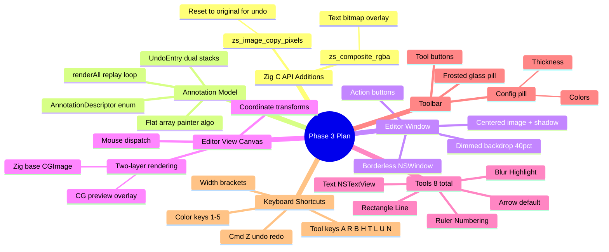

# ZigShot Phase 3: Annotation Editor — Implementation Plan

> **For agentic workers:** REQUIRED SUB-SKILL: Use superpowers:subagent-driven-development (recommended) or superpowers:executing-plans to implement this plan task-by-task. Steps use checkbox (`- [ ]`) syntax for tracking.

**Goal:** Build an interactive annotation editor that opens after capture — borderless window, 8 drawing tools, undo/redo, toolbar, and keyboard shortcuts. The fastest path: capture → annotate → Cmd+C → gone.

**Architecture:** Swift owns interaction and model. Zig owns pixels. C API is the membrane. Two-layer rendering: Zig pixel buffer (committed) + Core Graphics overlay (in-progress preview). Layer-backed NSView, no Metal.

**Tech Stack:** Zig 0.15.2 (core), Swift 5.9+ (macOS 14+), AppKit, ScreenCaptureKit, ImageIO

**Design Spec:** `docs/superpowers/specs/2026-04-05-annotation-editor-design.md`

---

## Context



**Dependency graph:** Tasks 13-15 are independent (different layers). Task 16 depends on 13+14+15. Task 17 depends on 16. Task 18 depends on 17. Tasks 19-22 are independent (different tools, all depend on 18). Task 23 depends on 18. Task 24 depends on 13+23. Task 25 depends on all.

For subagent execution: Tasks 13, 14, 15 can run in parallel. Tasks 19, 20, 21, 22 can run in parallel after Task 18.

---

## File Structure

### New Files
| File | Purpose |
|------|---------|
| `app/Sources/ZigShot/AnnotationEditorWindow.swift` | Borderless NSWindow, dimmed backdrop, action buttons, window lifecycle |
| `app/Sources/ZigShot/AnnotationEditorView.swift` | Canvas NSView — two-layer draw loop, mouse dispatch, coordinate transforms |
| `app/Sources/ZigShot/AnnotationModel.swift` | Annotation descriptor array, undo/redo stacks, renderAll replay |
| `app/Sources/ZigShot/AnnotationToolHandler.swift` | Protocol + 8 concrete tool handlers |
| `app/Sources/ZigShot/AnnotationToolbar.swift` | Frosted pill toolbar, tool buttons, contextual config pill |
| `app/Sources/ZigShot/TextEditingController.swift` | NSTextView overlay lifecycle for Text tool |

### Modified Files
| File | Change |
|------|--------|
| `src/core/c_api.zig:93-155` | Add `zs_image_copy_pixels`, `zs_composite_rgba` |
| `include/zigshot.h:48-71` | Add C declarations for new functions |
| `app/Sources/CZigShot/include/zigshot.h` | Mirror updated header |
| `app/Sources/ZigShot/ZigShotBridge.swift:60-176` | Add `copyPixels`, `compositeRGBA` wrappers |
| `app/Sources/ZigShot/AppDelegate.swift:127-157` | Replace desktop save with editor launch |

---

## Phase 3: Annotation Editor

### Task 13: Zig C API — zs_image_copy_pixels + zs_composite_rgba

**Files:**
- Modify: `src/core/c_api.zig`
- Modify: `include/zigshot.h`
- Modify: `app/Sources/CZigShot/include/zigshot.h`

- [ ] **Step 1: Add zs_image_copy_pixels to c_api.zig**

Add after the `zs_image_get_stride` function (after line 91). This copies all pixel data from `src` into `dst` (both must be same dimensions). Used by the undo system to reset an image to the original capture before replaying annotations.

```zig
/// Copy all pixel data from src into dst. Both images must have identical dimensions.
/// Returns false if dimensions don't match.
export fn zs_image_copy_pixels(dst: *Image, src: *const Image) bool {
    if (dst.width != src.width or dst.height != src.height) return false;
    @memcpy(dst.pixels, src.pixels);
    return true;
}
```

- [ ] **Step 2: Add zs_composite_rgba to c_api.zig**

Add after `zs_image_copy_pixels`. This composites an external RGBA bitmap onto an image at (x, y) using Porter-Duff "source over" — used by Swift to overlay text rendered by NSAttributedString.

```zig
/// Composite an external RGBA bitmap onto the image at position (at_x, at_y).
/// Uses Porter-Duff "source over" alpha blending.
/// The overlay buffer must be RGBA, tightly packed (stride = overlay_w * 4).
export fn zs_composite_rgba(
    img: *Image,
    overlay: [*]const u8,
    overlay_w: u32,
    overlay_h: u32,
    overlay_stride: u32,
    at_x: i32,
    at_y: i32,
) void {
    var y: u32 = 0;
    while (y < overlay_h) : (y += 1) {
        var x: u32 = 0;
        while (x < overlay_w) : (x += 1) {
            const dx = at_x + @as(i32, @intCast(x));
            const dy = at_y + @as(i32, @intCast(y));
            if (dx < 0 or dy < 0) continue;
            const ux: u32 = @intCast(dx);
            const uy: u32 = @intCast(dy);
            if (ux >= img.width or uy >= img.height) continue;

            const src_off = @as(usize, y) * @as(usize, overlay_stride) + @as(usize, x) * 4;
            const fg = Color{
                .r = overlay[src_off],
                .g = overlay[src_off + 1],
                .b = overlay[src_off + 2],
                .a = overlay[src_off + 3],
            };
            if (fg.a == 0) continue;

            const bg = img.getPixel(ux, uy) orelse continue;
            img.setPixel(ux, uy, Color.blend(fg, bg));
        }
    }
}
```

- [ ] **Step 3: Update include/zigshot.h**

Add after the pixel access section:

```c
/* ---- Pixel operations ---- */

/** Copy all pixels from src to dst. Both must have same dimensions. Returns false on mismatch. */
bool zs_image_copy_pixels(ZsImage* dst, const ZsImage* src);

/** Composite RGBA overlay onto image at (at_x, at_y) with alpha blending. */
void zs_composite_rgba(ZsImage* img, const uint8_t* overlay, uint32_t overlay_w,
                       uint32_t overlay_h, uint32_t overlay_stride, int32_t at_x, int32_t at_y);
```

- [ ] **Step 4: Mirror header to SPM**

Copy the updated header to `app/Sources/CZigShot/include/zigshot.h`.

- [ ] **Step 5: Add tests for new functions**

Add to the test section of `c_api.zig`:

```zig
test "c_api: image copy pixels" {
    const src = zs_image_create_empty(10, 10);
    try std.testing.expect(src != null);
    defer zs_image_destroy(src.?);

    // Paint src red
    const px = zs_image_get_pixels(src.?);
    px[0] = 255; px[1] = 0; px[2] = 0; px[3] = 255;

    const dst = zs_image_create_empty(10, 10);
    try std.testing.expect(dst != null);
    defer zs_image_destroy(dst.?);

    try std.testing.expect(zs_image_copy_pixels(dst.?, src.?));
    const dst_px = zs_image_get_pixels(dst.?);
    try std.testing.expectEqual(@as(u8, 255), dst_px[0]); // R copied
}

test "c_api: image copy pixels dimension mismatch" {
    const a = zs_image_create_empty(10, 10);
    defer zs_image_destroy(a.?);
    const b = zs_image_create_empty(20, 20);
    defer zs_image_destroy(b.?);
    try std.testing.expect(!zs_image_copy_pixels(a.?, b.?));
}

test "c_api: composite rgba overlays pixels" {
    const img = zs_image_create_empty(10, 10);
    try std.testing.expect(img != null);
    defer zs_image_destroy(img.?);

    // 2x2 red overlay, fully opaque
    var overlay = [_]u8{
        255, 0, 0, 255,  255, 0, 0, 255,
        255, 0, 0, 255,  255, 0, 0, 255,
    };
    zs_composite_rgba(img.?, &overlay, 2, 2, 8, 3, 3);

    const px = zs_image_get_pixels(img.?);
    const stride = zs_image_get_stride(img.?);
    const offset = @as(usize, 3) * @as(usize, stride) + @as(usize, 3) * 4;
    try std.testing.expectEqual(@as(u8, 255), px[offset]);     // R
    try std.testing.expectEqual(@as(u8, 255), px[offset + 3]); // A
}
```

- [ ] **Step 6: Verify**

Run:
```bash
cd /Users/s3nik/Desktop/zigshot && zig build test
```
Expected: All tests pass including 3 new tests.

- [ ] **Step 7: Rebuild library**

Run:
```bash
cd /Users/s3nik/Desktop/zigshot && zig build
```
Expected: `libzigshot.a` rebuilds without errors. `zig-out/lib/libzigshot.a` updated.

- [ ] **Step 8: Commit**

```bash
git add src/core/c_api.zig include/zigshot.h app/Sources/CZigShot/include/zigshot.h
git commit -m "feat(core): add zs_image_copy_pixels and zs_composite_rgba to C API

Enable pixel buffer copying (for undo reset-to-original) and RGBA bitmap
compositing (for Swift text rendering overlay). Both needed for Phase 3
annotation editor."
```

---

### Task 14: AnnotationModel — Descriptor enum, undo/redo stacks

**Files:**
- Create: `app/Sources/ZigShot/AnnotationModel.swift`

- [ ] **Step 1: Create AnnotationModel.swift**

This is the source of truth for all annotation state. Uses a flat array (painter's algorithm ordering). Undo/redo uses a custom dual-stack, NOT Apple's UndoManager.

```swift
import Foundation
import AppKit

/// Mirrors the annotation types renderable by the Zig core.
/// Swift owns the descriptors; Zig renders the pixels.
enum AnnotationDescriptor: Equatable {
    case arrow(from: CGPoint, to: CGPoint, color: NSColor, width: UInt32)
    case rectangle(rect: CGRect, color: NSColor, width: UInt32)
    case line(from: CGPoint, to: CGPoint, color: NSColor, width: UInt32)
    case blur(rect: CGRect, radius: UInt32)
    case highlight(rect: CGRect, color: NSColor)
    case ruler(from: CGPoint, to: CGPoint, color: NSColor, width: UInt32)
    case numbering(position: CGPoint, number: Int, color: NSColor)
    case text(position: CGPoint, content: String, fontSize: CGFloat, color: NSColor)

    /// Bounding rect for hit-testing and selection handles.
    var bounds: CGRect {
        switch self {
        case .arrow(let from, let to, _, let width):
            let minX = min(from.x, to.x) - CGFloat(width)
            let minY = min(from.y, to.y) - CGFloat(width)
            let maxX = max(from.x, to.x) + CGFloat(width)
            let maxY = max(from.y, to.y) + CGFloat(width)
            return CGRect(x: minX, y: minY, width: maxX - minX, height: maxY - minY)
        case .rectangle(let rect, _, _): return rect
        case .line(let from, let to, _, let width):
            let minX = min(from.x, to.x) - CGFloat(width)
            let minY = min(from.y, to.y) - CGFloat(width)
            let maxX = max(from.x, to.x) + CGFloat(width)
            let maxY = max(from.y, to.y) + CGFloat(width)
            return CGRect(x: minX, y: minY, width: maxX - minX, height: maxY - minY)
        case .blur(let rect, _): return rect
        case .highlight(let rect, _): return rect
        case .ruler(let from, let to, _, _):
            return CGRect(
                x: min(from.x, to.x), y: min(from.y, to.y),
                width: abs(to.x - from.x), height: abs(to.y - from.y)
            )
        case .numbering(let pos, _, _):
            return CGRect(x: pos.x - 14, y: pos.y - 14, width: 28, height: 28)
        case .text(let pos, _, let fontSize, _):
            return CGRect(x: pos.x, y: pos.y, width: 200, height: fontSize * 1.5)
        }
    }
}

/// Undo history entry. Each mouseUp that changes state creates one entry.
enum UndoEntry {
    case added(AnnotationDescriptor)
    case deleted(AnnotationDescriptor, Int)  // annotation + former index
    case modified(old: AnnotationDescriptor, new: AnnotationDescriptor)
}

/// Source of truth for annotation state. Owns the annotation array and undo stacks.
final class AnnotationModel {
    private(set) var annotations: [AnnotationDescriptor] = []
    private var undoStack: [UndoEntry] = []
    private var redoStack: [UndoEntry] = []

    /// Callback when annotations change (triggers re-render).
    var onChange: (() -> Void)?

    var canUndo: Bool { !undoStack.isEmpty }
    var canRedo: Bool { !redoStack.isEmpty }

    // MARK: - Mutating operations

    func add(_ annotation: AnnotationDescriptor) {
        annotations.append(annotation)
        undoStack.append(.added(annotation))
        redoStack.removeAll()
        onChange?()
    }

    func remove(at index: Int) {
        let removed = annotations.remove(at: index)
        undoStack.append(.deleted(removed, index))
        redoStack.removeAll()
        onChange?()
    }

    func update(at index: Int, to newValue: AnnotationDescriptor) {
        let old = annotations[index]
        annotations[index] = newValue
        undoStack.append(.modified(old: old, new: newValue))
        redoStack.removeAll()
        onChange?()
    }

    // MARK: - Undo / Redo

    func undo() {
        guard let entry = undoStack.popLast() else { return }
        switch entry {
        case .added(let desc):
            if let idx = annotations.lastIndex(where: { $0 == desc }) {
                annotations.remove(at: idx)
            }
            redoStack.append(entry)
        case .deleted(let desc, let index):
            let safeIndex = min(index, annotations.count)
            annotations.insert(desc, at: safeIndex)
            redoStack.append(entry)
        case .modified(let old, let new):
            if let idx = annotations.firstIndex(where: { $0 == new }) {
                annotations[idx] = old
            }
            redoStack.append(entry)
        }
        onChange?()
    }

    func redo() {
        guard let entry = redoStack.popLast() else { return }
        switch entry {
        case .added(let desc):
            annotations.append(desc)
            undoStack.append(entry)
        case .deleted(_, let index):
            if index < annotations.count {
                let removed = annotations.remove(at: index)
                undoStack.append(.deleted(removed, index))
            }
            redoStack.append(entry) // keep for potential re-redo
        case .modified(let old, let new):
            if let idx = annotations.firstIndex(where: { $0 == old }) {
                annotations[idx] = new
            }
            undoStack.append(entry)
        }
        onChange?()
    }

    // MARK: - Render all annotations onto a Zig image

    /// Replays all annotations onto the given image via the bridge.
    /// Call after resetting image to original pixels (via zs_image_copy_pixels).
    func renderAll(onto image: ZigShotImage) {
        for annotation in annotations {
            switch annotation {
            case .arrow(let from, let to, let color, let width):
                image.drawArrow(from: from, to: to, color: color, width: width)
            case .rectangle(let rect, let color, let width):
                image.drawRect(rect, color: color, width: width)
            case .line(let from, let to, let color, let width):
                image.drawLine(from: from, to: to, color: color, width: width)
            case .blur(let rect, let radius):
                image.blur(rect, radius: radius)
            case .highlight(let rect, let color):
                image.highlight(rect, color: color)
            case .ruler(let from, let to, let color, let width):
                image.drawRuler(from: from, to: to, color: color, width: width)
            case .numbering, .text:
                break // Rendered by Swift, composited separately
            }
        }
    }
}
```

- [ ] **Step 2: Verify compilation**

Run:
```bash
cd /Users/s3nik/Desktop/zigshot/app && swift build 2>&1 | head -5
```
Expected: Compiles without errors (or only warnings).

- [ ] **Step 3: Commit**

```bash
git add app/Sources/ZigShot/AnnotationModel.swift
git commit -m "feat(app): AnnotationModel — descriptor enum, undo/redo stacks

Source of truth for annotation state. AnnotationDescriptor enum mirrors
Zig annotation types. Custom dual-stack undo/redo (not Apple's UndoManager).
renderAll() replays annotations via ZigShotBridge."
```

---

### Task 15: AnnotationEditorWindow — Borderless window with dimmed backdrop

**Files:**
- Create: `app/Sources/ZigShot/AnnotationEditorWindow.swift`

- [ ] **Step 1: Create AnnotationEditorWindow.swift**

Borderless fullscreen NSWindow with 40% black backdrop. Shows captured image centered with drop shadow. Action buttons (Copy, Save, Discard) right-aligned at bottom.

```swift
import AppKit

/// Borderless fullscreen window for the annotation editor.
/// After capture, the image appears centered on a softly dimmed screen.
final class AnnotationEditorWindow: NSWindow {

    /// Callbacks for action buttons.
    var onCopy: (() -> Void)?
    var onSave: (() -> Void)?
    var onDiscard: (() -> Void)?

    init() {
        guard let screen = NSScreen.main else {
            super.init(
                contentRect: .zero,
                styleMask: .borderless,
                backing: .buffered,
                defer: false
            )
            return
        }

        super.init(
            contentRect: screen.frame,
            styleMask: .borderless,
            backing: .buffered,
            defer: false
        )

        level = .floating
        isOpaque = false
        backgroundColor = NSColor.black.withAlphaComponent(0.4)
        collectionBehavior = [.canJoinAllSpaces, .fullScreenAuxiliary]
        hasShadow = false
    }

    /// Show the editor and make it key.
    func present() {
        makeKeyAndOrderFront(nil)
        NSApp.activate(ignoringOtherApps: true)
    }

    /// Close the editor and clean up.
    func dismiss() {
        orderOut(nil)
    }

    override var canBecomeKey: Bool { true }
    override var canBecomeMain: Bool { true }
}
```

- [ ] **Step 2: Verify compilation**

Run:
```bash
cd /Users/s3nik/Desktop/zigshot/app && swift build 2>&1 | head -5
```
Expected: Compiles without errors.

- [ ] **Step 3: Commit**

```bash
git add app/Sources/ZigShot/AnnotationEditorWindow.swift
git commit -m "feat(app): AnnotationEditorWindow — borderless dimmed backdrop

Fullscreen borderless NSWindow with 40% black overlay. Floating level,
visible on all spaces. Present/dismiss lifecycle for annotation editor."
```

---

### Task 16: AnnotationEditorView — Canvas with two-layer rendering

**Files:**
- Create: `app/Sources/ZigShot/AnnotationEditorView.swift`

- [ ] **Step 1: Create AnnotationEditorView.swift**

Layer-backed NSView that renders two layers: (1) Zig pixel buffer as CGImage (committed annotations), (2) Core Graphics overlay for in-progress annotation preview. Handles mouse dispatch to tool handlers.

```swift
import AppKit
import CZigShot

/// The annotation canvas. Displays the captured image and handles mouse events for drawing.
///
/// Rendering pipeline — two layers, one view:
/// 1. Base layer: Original capture + committed annotations (Zig pixel buffer → CGImage)
/// 2. Preview layer: In-progress annotation drawn with Core Graphics (updates every mouseDragged)
final class AnnotationEditorView: NSView {

    // MARK: - State

    /// The working image with committed annotations (Zig-owned pixels).
    private(set) var workingImage: ZigShotImage
    /// Pristine copy of original capture (never modified — used for undo reset).
    let originalImage: ZigShotImage

    let model: AnnotationModel

    /// The active tool handler (nil = Arrow default on next mouseDown).
    var activeToolHandler: AnnotationToolHandler?
    /// Current annotation color.
    var currentColor: NSColor = NSColor(red: 1.0, green: 0.231, blue: 0.188, alpha: 1.0) // #FF3B30
    /// Current stroke width.
    var currentStrokeWidth: UInt32 = 3
    /// Currently selected annotation index (nil = none).
    var selectedAnnotationIndex: Int?

    /// In-progress drawing state for Core Graphics preview.
    private var drawStartPoint: CGPoint?
    private var drawCurrentPoint: CGPoint?
    private var isDrawing = false

    /// Image rect in view coordinates (centered with shadow offset).
    private(set) var imageRect: CGRect = .zero

    // MARK: - Init

    init(workingImage: ZigShotImage, originalImage: ZigShotImage, model: AnnotationModel) {
        self.workingImage = workingImage
        self.originalImage = originalImage
        self.model = model
        super.init(frame: .zero)

        wantsLayer = true
        layerContentsRedrawPolicy = .onSetNeedsDisplay

        model.onChange = { [weak self] in
            self?.rerender()
        }
    }

    required init?(coder: NSCoder) { fatalError("Not implemented") }

    // MARK: - Layout

    override func layout() {
        super.layout()
        recalcImageRect()
    }

    /// Centers the image in the view with proportional sizing.
    private func recalcImageRect() {
        let imgW = CGFloat(workingImage.width)
        let imgH = CGFloat(workingImage.height)
        let viewW = bounds.width
        let viewH = bounds.height

        // Fit image within 90% of view bounds
        let maxW = viewW * 0.9
        let maxH = viewH * 0.85 // Leave room for toolbar below
        let scale = min(maxW / imgW, maxH / imgH, 1.0) // Never upscale

        let drawW = imgW * scale
        let drawH = imgH * scale
        let x = (viewW - drawW) / 2
        let y = (viewH - drawH) / 2 + 20 // Slight upward offset for toolbar

        imageRect = CGRect(x: x, y: y, width: drawW, height: drawH)
    }

    // MARK: - Coordinate transforms

    /// Convert view coordinates to image pixel coordinates.
    func viewToImage(_ viewPoint: CGPoint) -> CGPoint {
        let imgW = CGFloat(workingImage.width)
        let imgH = CGFloat(workingImage.height)
        let scaleX = imgW / imageRect.width
        let scaleY = imgH / imageRect.height
        return CGPoint(
            x: (viewPoint.x - imageRect.origin.x) * scaleX,
            y: (viewPoint.y - imageRect.origin.y) * scaleY
        )
    }

    /// Convert image pixel coordinates to view coordinates.
    func imageToView(_ imgPoint: CGPoint) -> CGPoint {
        let imgW = CGFloat(workingImage.width)
        let imgH = CGFloat(workingImage.height)
        let scaleX = imageRect.width / imgW
        let scaleY = imageRect.height / imgH
        return CGPoint(
            x: imgPoint.x * scaleX + imageRect.origin.x,
            y: imgPoint.y * scaleY + imageRect.origin.y
        )
    }

    // MARK: - Rendering

    /// Re-render all annotations from the original image.
    func rerender() {
        zs_image_copy_pixels(
            workingImage.opaqueHandle,
            originalImage.opaqueHandle
        )
        model.renderAll(onto: workingImage)
        needsDisplay = true
    }

    override func draw(_ dirtyRect: NSRect) {
        guard let ctx = NSGraphicsContext.current?.cgContext else { return }

        // Layer 1: Zig pixel buffer as CGImage
        if let cgImage = workingImage.cgImage() {
            // Drop shadow behind image
            ctx.setShadow(offset: CGSize(width: 0, height: -4), blur: 20,
                          color: NSColor.black.withAlphaComponent(0.5).cgColor)
            ctx.draw(cgImage, in: imageRect)
            ctx.setShadow(offset: .zero, blur: 0) // Reset shadow
        }

        // Layer 2: In-progress annotation preview (Core Graphics)
        if isDrawing, let start = drawStartPoint, let current = drawCurrentPoint {
            let viewStart = imageToView(start)
            let viewCurrent = imageToView(current)
            activeToolHandler?.drawPreview(
                in: ctx,
                from: viewStart,
                to: viewCurrent,
                color: currentColor,
                width: CGFloat(currentStrokeWidth),
                imageRect: imageRect
            )
        }

        // Selection handles
        if let idx = selectedAnnotationIndex, idx < model.annotations.count {
            drawSelectionHandles(ctx, for: model.annotations[idx])
        }
    }

    private func drawSelectionHandles(_ ctx: CGContext, for annotation: AnnotationDescriptor) {
        let bounds = annotation.bounds
        let corners = [
            imageToView(CGPoint(x: bounds.minX, y: bounds.minY)),
            imageToView(CGPoint(x: bounds.maxX, y: bounds.minY)),
            imageToView(CGPoint(x: bounds.maxX, y: bounds.maxY)),
            imageToView(CGPoint(x: bounds.minX, y: bounds.maxY)),
        ]

        ctx.setFillColor(NSColor.white.withAlphaComponent(0.6).cgColor)
        ctx.setStrokeColor(NSColor.white.cgColor)
        ctx.setLineWidth(1.0)
        for corner in corners {
            let handle = CGRect(x: corner.x - 3, y: corner.y - 3, width: 6, height: 6)
            ctx.fillEllipse(in: handle)
            ctx.strokeEllipse(in: handle)
        }
    }

    // MARK: - Mouse events

    override var acceptsFirstResponder: Bool { true }

    override func mouseDown(with event: NSEvent) {
        let viewPoint = convert(event.locationInWindow, from: nil)
        let imgPoint = viewToImage(viewPoint)

        // Only handle clicks inside the image
        guard imageRect.contains(viewPoint) else { return }

        // Use Arrow as default if no tool selected
        let handler = activeToolHandler ?? ArrowToolHandler()

        drawStartPoint = imgPoint
        drawCurrentPoint = imgPoint
        isDrawing = true
        handler.start(at: imgPoint)
        needsDisplay = true
    }

    override func mouseDragged(with event: NSEvent) {
        guard isDrawing else { return }
        let viewPoint = convert(event.locationInWindow, from: nil)
        let imgPoint = viewToImage(viewPoint)

        drawCurrentPoint = imgPoint
        let handler = activeToolHandler ?? ArrowToolHandler()
        handler.update(to: imgPoint)
        needsDisplay = true
    }

    override func mouseUp(with event: NSEvent) {
        guard isDrawing, let start = drawStartPoint, let current = drawCurrentPoint else { return }
        isDrawing = false

        let handler = activeToolHandler ?? ArrowToolHandler()
        if let annotation = handler.finish(
            from: start, to: current,
            color: currentColor, width: currentStrokeWidth
        ) {
            model.add(annotation)
        }

        drawStartPoint = nil
        drawCurrentPoint = nil
        needsDisplay = true
    }

    override func keyDown(with event: NSEvent) {
        if event.keyCode == 53 { // Escape
            if isDrawing {
                isDrawing = false
                drawStartPoint = nil
                drawCurrentPoint = nil
                needsDisplay = true
            } else {
                window?.close()
            }
        }
    }
}
```

**Note:** This references `opaqueHandle` on ZigShotImage which will be exposed in Task 17. It also references `ArrowToolHandler` and `AnnotationToolHandler` protocol from Task 18. The code compiles fully after Tasks 17+18 are done — this task establishes the canvas infrastructure.

- [ ] **Step 2: Verify compilation (may have forward references — OK)**

Compilation will succeed after Tasks 17+18 are complete. For now verify the file is syntactically correct by checking no obvious typos.

- [ ] **Step 3: Commit**

```bash
git add app/Sources/ZigShot/AnnotationEditorView.swift
git commit -m "feat(app): AnnotationEditorView — two-layer canvas with mouse dispatch

Layer-backed NSView with two rendering layers: Zig pixel buffer (committed)
and Core Graphics overlay (in-progress preview). Coordinate transforms
between view and image space. Mouse event routing to tool handlers."
```

---

### Task 17: ZigShotBridge extensions + AppDelegate integration

**Files:**
- Modify: `app/Sources/ZigShot/ZigShotBridge.swift`
- Modify: `app/Sources/ZigShot/AppDelegate.swift`

- [ ] **Step 1: Add opaqueHandle and new wrappers to ZigShotBridge.swift**

Add a computed property to expose the opaque handle (needed by AnnotationEditorView for `zs_image_copy_pixels`). Add wrappers for the two new C API functions.

After the `pixels` property (line 13), add:

```swift
/// Expose the opaque handle for direct C API calls (used by EditorView).
var opaqueHandle: OpaquePointer { handle }
```

After the `drawEllipse` method (line 113), add:

```swift
/// Copy all pixels from another image into this one (same dimensions required).
/// Used by undo system to reset to original capture before replaying annotations.
@discardableResult
func copyPixels(from source: ZigShotImage) -> Bool {
    return zs_image_copy_pixels(handle, source.opaqueHandle)
}

/// Composite an RGBA bitmap onto this image at the given position.
/// Used for overlaying Swift-rendered text onto the Zig pixel buffer.
func compositeRGBA(_ pixels: UnsafePointer<UInt8>, width: UInt32, height: UInt32,
                   stride: UInt32, at x: Int32, y: Int32) {
    zs_composite_rgba(handle, pixels, width, height, stride, x, y)
}
```

- [ ] **Step 2: Modify AppDelegate to open editor after capture**

Replace the contents of `handleCapturedImage` (lines 128-156) with:

```swift
@MainActor
private func handleCapturedImage(_ cgImage: CGImage) {
    guard let workingImage = ZigShotImage.fromCGImage(cgImage) else {
        print("[ZigShot] Failed to convert captured image to Zig format")
        return
    }
    guard let originalImage = ZigShotImage.fromCGImage(cgImage) else {
        print("[ZigShot] Failed to create original copy")
        return
    }

    let width = workingImage.width
    let height = workingImage.height
    print("[ZigShot] Captured \(width)x\(height) — opening editor")

    openAnnotationEditor(workingImage: workingImage, originalImage: originalImage)
}
```

Add a new property to hold the editor reference and the editor launch method:

```swift
private var editorWindow: AnnotationEditorWindow?

@MainActor
private func openAnnotationEditor(workingImage: ZigShotImage, originalImage: ZigShotImage) {
    let model = AnnotationModel()
    let editorView = AnnotationEditorView(
        workingImage: workingImage,
        originalImage: originalImage,
        model: model
    )

    let window = AnnotationEditorWindow()
    window.contentView = editorView
    editorView.frame = window.frame

    let scaleFactor = NSScreen.main?.backingScaleFactor ?? 2.0
    let dpi = 72.0 * scaleFactor

    window.onCopy = { [weak window] in
        if workingImage.copyToClipboard() {
            print("[ZigShot] Copied to clipboard")
        }
        window?.dismiss()
    }

    window.onSave = { [weak window] in
        let formatter = DateFormatter()
        formatter.dateFormat = "yyyy-MM-dd-HHmmss"
        let filename = "ZigShot-\(formatter.string(from: Date())).png"
        let desktopURL = FileManager.default.homeDirectoryForCurrentUser
            .appendingPathComponent("Desktop")
            .appendingPathComponent(filename)
        if workingImage.savePNG(to: desktopURL, dpi: dpi) {
            print("[ZigShot] Saved: \(desktopURL.path)")
        }
        window?.dismiss()
    }

    window.onDiscard = { [weak window] in
        print("[ZigShot] Discarded")
        window?.dismiss()
    }

    self.editorWindow = window
    window.present()
}
```

- [ ] **Step 3: Verify build**

Run:
```bash
cd /Users/s3nik/Desktop/zigshot && zig build && cd app && swift build 2>&1 | tail -5
```
Expected: Both Zig and Swift compile. Note: may have forward reference warnings for `ArrowToolHandler`/`AnnotationToolHandler` protocol until Task 18.

- [ ] **Step 4: Commit**

```bash
git add app/Sources/ZigShot/ZigShotBridge.swift app/Sources/ZigShot/AppDelegate.swift
git commit -m "feat(app): bridge extensions + capture → editor integration

Expose opaqueHandle, copyPixels, compositeRGBA on ZigShotBridge. Replace
AppDelegate desktop-save with annotation editor launch. Capture → editor
flow now opens borderless window with the captured image."
```

---

### ⚑ Checkpoint A: Editor Infrastructure

**Verify end-to-end:** Capture → editor opens → image visible on dimmed backdrop.

Run:
```bash
cd /Users/s3nik/Desktop/zigshot && zig build && cd app && swift build && swift run
```

Expected:
- Menu bar icon appears
- Cmd+Shift+3 captures fullscreen
- Editor opens: dimmed backdrop, captured image centered
- Esc closes editor
- Console shows `[ZigShot] Captured WxH — opening editor`

**Note:** Drawing tools don't work yet. Copy/Save/Discard buttons are wired but the toolbar UI comes later (Task 25). Keyboard-only at this point.

---

### Task 18: AnnotationToolHandler protocol + Arrow tool

**Files:**
- Create: `app/Sources/ZigShot/AnnotationToolHandler.swift`

- [ ] **Step 1: Create AnnotationToolHandler.swift with protocol + Arrow**

The protocol defines the contract all tools follow. Arrow is the default tool — clicking and dragging without selecting any tool draws an arrow.

```swift
import AppKit

/// Contract for annotation tools. Each tool handles one drawing gesture.
///
/// Lifecycle: start(at:) → update(to:) (0+ times) → finish(from:to:) → AnnotationDescriptor
protocol AnnotationToolHandler: AnyObject {
    /// Called on mouseDown with image-space coordinates.
    func start(at point: CGPoint)
    /// Called on mouseDragged with image-space coordinates.
    func update(to point: CGPoint)
    /// Called on mouseUp. Returns the annotation to commit, or nil if too small.
    func finish(from start: CGPoint, to end: CGPoint,
                color: NSColor, width: UInt32) -> AnnotationDescriptor?
    /// Draw a Core Graphics preview of the in-progress annotation.
    func drawPreview(in ctx: CGContext, from: CGPoint, to: CGPoint,
                     color: NSColor, width: CGFloat, imageRect: CGRect)
}

// MARK: - Arrow Tool (Default)

/// The most common annotation. Click-drag to draw an arrow.
/// Default tool: if no tool is selected, Arrow is used.
final class ArrowToolHandler: AnnotationToolHandler {
    func start(at point: CGPoint) {}
    func update(to point: CGPoint) {}

    func finish(from start: CGPoint, to end: CGPoint,
                color: NSColor, width: UInt32) -> AnnotationDescriptor? {
        // Minimum drag distance: 5px
        let dx = end.x - start.x
        let dy = end.y - start.y
        guard sqrt(dx * dx + dy * dy) >= 5 else { return nil }
        return .arrow(from: start, to: end, color: color, width: width)
    }

    func drawPreview(in ctx: CGContext, from: CGPoint, to: CGPoint,
                     color: NSColor, width: CGFloat, imageRect: CGRect) {
        ctx.setStrokeColor(color.cgColor)
        ctx.setLineWidth(width)
        ctx.setLineCap(.round)

        // Line
        ctx.move(to: from)
        ctx.addLine(to: to)
        ctx.strokePath()

        // Arrowhead
        let angle = atan2(to.y - from.y, to.x - from.x)
        let headLength: CGFloat = 12
        let headAngle: CGFloat = .pi / 6

        let p1 = CGPoint(
            x: to.x - headLength * cos(angle - headAngle),
            y: to.y - headLength * sin(angle - headAngle)
        )
        let p2 = CGPoint(
            x: to.x - headLength * cos(angle + headAngle),
            y: to.y - headLength * sin(angle + headAngle)
        )

        ctx.setFillColor(color.cgColor)
        ctx.move(to: to)
        ctx.addLine(to: p1)
        ctx.addLine(to: p2)
        ctx.closePath()
        ctx.fillPath()
    }
}
```

- [ ] **Step 2: Verify build and test arrow drawing**

Run:
```bash
cd /Users/s3nik/Desktop/zigshot && zig build && cd app && swift build && swift run
```
Expected: Capture → editor opens → click-drag on image → arrow preview during drag → arrow committed on release (visible in the image).

- [ ] **Step 3: Commit**

```bash
git add app/Sources/ZigShot/AnnotationToolHandler.swift
git commit -m "feat(app): AnnotationToolHandler protocol + Arrow tool

Protocol defines start/update/finish/drawPreview lifecycle for all tools.
ArrowToolHandler is the default — click-drag without selecting a tool
draws an anti-aliased arrow via Zig's Wu's algorithm."
```

---

### Task 19: Rectangle + Line tools

**Files:**
- Modify: `app/Sources/ZigShot/AnnotationToolHandler.swift`

- [ ] **Step 1: Add RectangleToolHandler and LineToolHandler**

Append to `AnnotationToolHandler.swift`:

```swift
// MARK: - Rectangle Tool

/// Draw rectangles. Shift-drag constrains to perfect square.
final class RectangleToolHandler: AnnotationToolHandler {
    func start(at point: CGPoint) {}
    func update(to point: CGPoint) {}

    func finish(from start: CGPoint, to end: CGPoint,
                color: NSColor, width: UInt32) -> AnnotationDescriptor? {
        let rect = CGRect(
            x: min(start.x, end.x), y: min(start.y, end.y),
            width: abs(end.x - start.x), height: abs(end.y - start.y)
        )
        guard rect.width >= 3 && rect.height >= 3 else { return nil }
        return .rectangle(rect: rect, color: color, width: width)
    }

    func drawPreview(in ctx: CGContext, from: CGPoint, to: CGPoint,
                     color: NSColor, width: CGFloat, imageRect: CGRect) {
        ctx.setStrokeColor(color.cgColor)
        ctx.setLineWidth(width)
        let rect = CGRect(
            x: min(from.x, to.x), y: min(from.y, to.y),
            width: abs(to.x - from.x), height: abs(to.y - from.y)
        )
        let path = CGPath(roundedRect: rect, cornerWidth: 4, cornerHeight: 4, transform: nil)
        ctx.addPath(path)
        ctx.strokePath()
    }
}

// MARK: - Line Tool

/// Draw straight lines. Shift-drag snaps to 45° angles.
final class LineToolHandler: AnnotationToolHandler {
    func start(at point: CGPoint) {}
    func update(to point: CGPoint) {}

    func finish(from start: CGPoint, to end: CGPoint,
                color: NSColor, width: UInt32) -> AnnotationDescriptor? {
        let dx = end.x - start.x
        let dy = end.y - start.y
        guard sqrt(dx * dx + dy * dy) >= 5 else { return nil }
        return .line(from: start, to: end, color: color, width: width)
    }

    func drawPreview(in ctx: CGContext, from: CGPoint, to: CGPoint,
                     color: NSColor, width: CGFloat, imageRect: CGRect) {
        ctx.setStrokeColor(color.cgColor)
        ctx.setLineWidth(width)
        ctx.setLineCap(.round)
        ctx.move(to: from)
        ctx.addLine(to: to)
        ctx.strokePath()
    }
}
```

- [ ] **Step 2: Verify build**

Run:
```bash
cd /Users/s3nik/Desktop/zigshot/app && swift build 2>&1 | tail -3
```
Expected: Compiles. (Tool switching tested after Task 25 keyboard shortcuts.)

- [ ] **Step 3: Commit**

```bash
git add app/Sources/ZigShot/AnnotationToolHandler.swift
git commit -m "feat(app): Rectangle + Line tool handlers

RectangleToolHandler draws outlined rects with 4px rounded corners.
LineToolHandler draws anti-aliased lines. Both include Core Graphics
preview during drag."
```

---

### Task 20: Blur + Highlight tools

**Files:**
- Modify: `app/Sources/ZigShot/AnnotationToolHandler.swift`

- [ ] **Step 1: Add BlurToolHandler and HighlightToolHandler**

Append to `AnnotationToolHandler.swift`:

```swift
// MARK: - Blur Tool

/// Drag a rectangle to blur the region underneath (redaction).
final class BlurToolHandler: AnnotationToolHandler {
    func start(at point: CGPoint) {}
    func update(to point: CGPoint) {}

    func finish(from start: CGPoint, to end: CGPoint,
                color: NSColor, width: UInt32) -> AnnotationDescriptor? {
        let rect = CGRect(
            x: min(start.x, end.x), y: min(start.y, end.y),
            width: abs(end.x - start.x), height: abs(end.y - start.y)
        )
        guard rect.width >= 5 && rect.height >= 5 else { return nil }
        return .blur(rect: rect, radius: 10)
    }

    func drawPreview(in ctx: CGContext, from: CGPoint, to: CGPoint,
                     color: NSColor, width: CGFloat, imageRect: CGRect) {
        let rect = CGRect(
            x: min(from.x, to.x), y: min(from.y, to.y),
            width: abs(to.x - from.x), height: abs(to.y - from.y)
        )
        ctx.setStrokeColor(NSColor.white.withAlphaComponent(0.5).cgColor)
        ctx.setLineWidth(1.5)
        ctx.setLineDash(phase: 0, lengths: [4, 4])
        ctx.stroke(rect)
        ctx.setLineDash(phase: 0, lengths: [])

        // Crosshatch pattern to hint at blur effect
        ctx.setFillColor(NSColor.white.withAlphaComponent(0.1).cgColor)
        ctx.fill(rect)
    }
}

// MARK: - Highlight Tool

/// Semi-transparent color overlay (like a highlighter pen).
final class HighlightToolHandler: AnnotationToolHandler {
    func start(at point: CGPoint) {}
    func update(to point: CGPoint) {}

    func finish(from start: CGPoint, to end: CGPoint,
                color: NSColor, width: UInt32) -> AnnotationDescriptor? {
        let rect = CGRect(
            x: min(start.x, end.x), y: min(start.y, end.y),
            width: abs(end.x - start.x), height: abs(end.y - start.y)
        )
        guard rect.width >= 3 && rect.height >= 3 else { return nil }
        return .highlight(rect: rect, color: color.withAlphaComponent(0.4))
    }

    func drawPreview(in ctx: CGContext, from: CGPoint, to: CGPoint,
                     color: NSColor, width: CGFloat, imageRect: CGRect) {
        let rect = CGRect(
            x: min(from.x, to.x), y: min(from.y, to.y),
            width: abs(to.x - from.x), height: abs(to.y - from.y)
        )
        ctx.setFillColor(color.withAlphaComponent(0.3).cgColor)
        ctx.fill(rect)
    }
}
```

- [ ] **Step 2: Verify build**

Run:
```bash
cd /Users/s3nik/Desktop/zigshot/app && swift build 2>&1 | tail -3
```
Expected: Compiles without errors.

- [ ] **Step 3: Commit**

```bash
git add app/Sources/ZigShot/AnnotationToolHandler.swift
git commit -m "feat(app): Blur + Highlight tool handlers

BlurToolHandler applies gaussian blur via Zig's blurRegion for redaction.
HighlightToolHandler draws semi-transparent color overlay at 40% opacity.
Both include visual previews during drag."
```

---

### Task 21: Ruler + Numbering tools

**Files:**
- Modify: `app/Sources/ZigShot/AnnotationToolHandler.swift`

- [ ] **Step 1: Add RulerToolHandler and NumberingToolHandler**

Append to `AnnotationToolHandler.swift`:

```swift
// MARK: - Ruler Tool

/// Drag to measure pixel distance. Shows px value along the line.
final class RulerToolHandler: AnnotationToolHandler {
    func start(at point: CGPoint) {}
    func update(to point: CGPoint) {}

    func finish(from start: CGPoint, to end: CGPoint,
                color: NSColor, width: UInt32) -> AnnotationDescriptor? {
        let dx = end.x - start.x
        let dy = end.y - start.y
        guard sqrt(dx * dx + dy * dy) >= 5 else { return nil }
        return .ruler(from: start, to: end, color: color, width: width)
    }

    func drawPreview(in ctx: CGContext, from: CGPoint, to: CGPoint,
                     color: NSColor, width: CGFloat, imageRect: CGRect) {
        ctx.setStrokeColor(color.cgColor)
        ctx.setLineWidth(width)
        ctx.setLineCap(.round)
        ctx.move(to: from)
        ctx.addLine(to: to)
        ctx.strokePath()

        // Distance label
        let dx = to.x - from.x
        let dy = to.y - from.y
        let dist = sqrt(dx * dx + dy * dy)
        let label = String(format: "%.0fpx", dist)
        let mid = CGPoint(x: (from.x + to.x) / 2, y: (from.y + to.y) / 2 - 12)
        let attrs: [NSAttributedString.Key: Any] = [
            .font: NSFont.monospacedSystemFont(ofSize: 11, weight: .medium),
            .foregroundColor: color,
            .backgroundColor: NSColor.black.withAlphaComponent(0.6),
        ]
        NSAttributedString(string: " \(label) ", attributes: attrs).draw(at: mid)
    }
}

// MARK: - Numbering Tool

/// Click to place auto-incrementing numbered circles.
final class NumberingToolHandler: AnnotationToolHandler {
    /// Tracks the next number to assign. Shared across the model.
    var nextNumber: Int = 1

    func start(at point: CGPoint) {}
    func update(to point: CGPoint) {}

    func finish(from start: CGPoint, to end: CGPoint,
                color: NSColor, width: UInt32) -> AnnotationDescriptor? {
        let number = nextNumber
        nextNumber += 1
        return .numbering(position: start, number: number, color: color)
    }

    func drawPreview(in ctx: CGContext, from: CGPoint, to: CGPoint,
                     color: NSColor, width: CGFloat, imageRect: CGRect) {
        // Just show a circle at the start point
        let size: CGFloat = 28
        let rect = CGRect(x: from.x - size / 2, y: from.y - size / 2, width: size, height: size)
        ctx.setFillColor(color.cgColor)
        ctx.fillEllipse(in: rect)

        let label = NSAttributedString(
            string: "\(1)",
            attributes: [
                .font: NSFont.systemFont(ofSize: 14, weight: .bold),
                .foregroundColor: NSColor.white,
            ]
        )
        let labelSize = label.size()
        label.draw(at: CGPoint(
            x: from.x - labelSize.width / 2,
            y: from.y - labelSize.height / 2
        ))
    }
}
```

- [ ] **Step 2: Verify build**

Run:
```bash
cd /Users/s3nik/Desktop/zigshot/app && swift build 2>&1 | tail -3
```
Expected: Compiles without errors.

- [ ] **Step 3: Commit**

```bash
git add app/Sources/ZigShot/AnnotationToolHandler.swift
git commit -m "feat(app): Ruler + Numbering tool handlers

RulerToolHandler measures pixel distances with label display.
NumberingToolHandler places auto-incrementing numbered circles.
Both tools use Zig core rendering on commit."
```

---

### Task 22: Text tool + TextEditingController

**Files:**
- Create: `app/Sources/ZigShot/TextEditingController.swift`
- Modify: `app/Sources/ZigShot/AnnotationToolHandler.swift`

- [ ] **Step 1: Create TextEditingController.swift**

Manages the NSTextView overlay lifecycle for inline text editing. When the user clicks with the Text tool, an NSTextView appears at that point. Typing commits on click-elsewhere or Escape.

```swift
import AppKit

/// Manages an inline NSTextView for the Text annotation tool.
/// Click → text field appears → type → click elsewhere or Escape → commit.
final class TextEditingController: NSObject, NSTextViewDelegate {

    private var textView: NSTextView?
    private var position: CGPoint = .zero
    private var fontSize: CGFloat = 16
    private var textColor: NSColor = .red
    private var onCommit: ((String, CGPoint, CGFloat, NSColor) -> Void)?

    /// Begin text editing at the given view-space position.
    func beginEditing(
        in parentView: NSView,
        at viewPosition: CGPoint,
        imagePosition: CGPoint,
        fontSize: CGFloat,
        color: NSColor,
        onCommit: @escaping (String, CGPoint, CGFloat, NSColor) -> Void
    ) {
        endEditing()

        self.position = imagePosition
        self.fontSize = fontSize
        self.textColor = color
        self.onCommit = onCommit

        let tv = NSTextView(frame: CGRect(
            x: viewPosition.x,
            y: viewPosition.y,
            width: 300,
            height: fontSize * 2
        ))
        tv.isRichText = false
        tv.font = NSFont.systemFont(ofSize: fontSize)
        tv.textColor = color
        tv.backgroundColor = NSColor.black.withAlphaComponent(0.3)
        tv.insertionPointColor = color
        tv.isAutomaticQuoteSubstitutionEnabled = false
        tv.isAutomaticDashSubstitutionEnabled = false
        tv.delegate = self

        parentView.addSubview(tv)
        tv.window?.makeFirstResponder(tv)

        self.textView = tv
    }

    /// Commit current text and remove the text view.
    func endEditing() {
        guard let tv = textView else { return }
        let text = tv.string.trimmingCharacters(in: .whitespacesAndNewlines)
        if !text.isEmpty {
            onCommit?(text, position, fontSize, textColor)
        }
        tv.removeFromSuperview()
        textView = nil
        onCommit = nil
    }

    /// Render text into an RGBA bitmap for compositing onto the Zig pixel buffer.
    static func renderTextBitmap(
        text: String, fontSize: CGFloat, color: NSColor
    ) -> (pixels: [UInt8], width: Int, height: Int)? {
        let attrs: [NSAttributedString.Key: Any] = [
            .font: NSFont.systemFont(ofSize: fontSize),
            .foregroundColor: color,
        ]
        let attrStr = NSAttributedString(string: text, attributes: attrs)
        let size = attrStr.size()

        let width = Int(ceil(size.width)) + 4
        let height = Int(ceil(size.height)) + 4
        guard width > 0 && height > 0 else { return nil }

        guard let colorSpace = CGColorSpace(name: CGColorSpace.sRGB),
              let ctx = CGContext(
                  data: nil,
                  width: width,
                  height: height,
                  bitsPerComponent: 8,
                  bytesPerRow: width * 4,
                  space: colorSpace,
                  bitmapInfo: CGImageAlphaInfo.premultipliedLast.rawValue
                      | CGBitmapInfo.byteOrder32Big.rawValue
              ) else { return nil }

        // Flip for text rendering
        ctx.translateBy(x: 0, y: CGFloat(height))
        ctx.scaleBy(x: 1, y: -1)

        let nsCtx = NSGraphicsContext(cgContext: ctx, flipped: true)
        NSGraphicsContext.saveGraphicsState()
        NSGraphicsContext.current = nsCtx
        attrStr.draw(at: CGPoint(x: 2, y: 2))
        NSGraphicsContext.restoreGraphicsState()

        guard let data = ctx.data else { return nil }
        let buffer = UnsafeBufferPointer(
            start: data.assumingMemoryBound(to: UInt8.self),
            count: width * height * 4
        )
        return (Array(buffer), width, height)
    }
}
```

- [ ] **Step 2: Add TextToolHandler to AnnotationToolHandler.swift**

Append to `AnnotationToolHandler.swift`:

```swift
// MARK: - Text Tool

/// Click to place text. Opens inline NSTextView for editing.
/// Text is rendered by Swift (NSAttributedString) and composited onto Zig buffer.
final class TextToolHandler: AnnotationToolHandler {
    weak var editorView: AnnotationEditorView?
    let textController = TextEditingController()

    func start(at point: CGPoint) {}
    func update(to point: CGPoint) {}

    func finish(from start: CGPoint, to end: CGPoint,
                color: NSColor, width: UInt32) -> AnnotationDescriptor? {
        // Text tool doesn't create annotation on mouseUp.
        // Instead, it opens a text field. Annotation is created on commit.
        guard let view = editorView else { return nil }

        let viewPoint = view.imageToView(start)
        textController.beginEditing(
            in: view,
            at: viewPoint,
            imagePosition: start,
            fontSize: 16,
            color: color
        ) { [weak view] text, position, fontSize, color in
            guard let view = view else { return }
            let annotation = AnnotationDescriptor.text(
                position: position,
                content: text,
                fontSize: fontSize,
                color: color
            )
            view.model.add(annotation)

            // Render text bitmap and composite onto Zig buffer
            if let bitmap = TextEditingController.renderTextBitmap(
                text: text, fontSize: fontSize, color: color
            ) {
                bitmap.pixels.withUnsafeBufferPointer { buf in
                    view.workingImage.compositeRGBA(
                        buf.baseAddress!,
                        width: UInt32(bitmap.width),
                        height: UInt32(bitmap.height),
                        stride: UInt32(bitmap.width * 4),
                        at: Int32(position.x),
                        y: Int32(position.y)
                    )
                }
                view.needsDisplay = true
            }
        }

        return nil // No immediate annotation — created asynchronously on text commit
    }

    func drawPreview(in ctx: CGContext, from: CGPoint, to: CGPoint,
                     color: NSColor, width: CGFloat, imageRect: CGRect) {
        // Show cursor indicator at start point
        ctx.setStrokeColor(color.cgColor)
        ctx.setLineWidth(1.5)
        ctx.move(to: CGPoint(x: from.x, y: from.y - 10))
        ctx.addLine(to: CGPoint(x: from.x, y: from.y + 10))
        ctx.strokePath()
    }
}
```

- [ ] **Step 3: Verify build**

Run:
```bash
cd /Users/s3nik/Desktop/zigshot/app && swift build 2>&1 | tail -5
```
Expected: Compiles without errors.

- [ ] **Step 4: Commit**

```bash
git add app/Sources/ZigShot/TextEditingController.swift app/Sources/ZigShot/AnnotationToolHandler.swift
git commit -m "feat(app): Text tool + TextEditingController

Inline NSTextView overlay for text annotations. TextEditingController
manages the text field lifecycle. Text is rendered via NSAttributedString
into an RGBA bitmap and composited onto the Zig buffer via zs_composite_rgba."
```

---

### ⚑ Checkpoint B: All 8 Tools Draw Annotations

**Verify all tools exist and compile:**

Run:
```bash
cd /Users/s3nik/Desktop/zigshot && zig build && cd app && swift build
```

Expected: Clean compile. All tool handlers defined:
- ArrowToolHandler, RectangleToolHandler, LineToolHandler
- BlurToolHandler, HighlightToolHandler
- RulerToolHandler, NumberingToolHandler
- TextToolHandler + TextEditingController

**Manual test (after Task 25 wires keyboard shortcuts):**
Each tool produces Core Graphics preview during drag, commits to Zig on mouseUp.

---

### Task 23: Selection, move, resize, delete

**Files:**
- Modify: `app/Sources/ZigShot/AnnotationEditorView.swift`

- [ ] **Step 1: Add hit-testing and selection to AnnotationEditorView**

Add these methods to AnnotationEditorView for annotation selection, movement, and deletion. Modify the `mouseDown` method to check for hits on existing annotations before starting a new drawing gesture.

Replace the `mouseDown` method and add selection support:

```swift
// --- Selection state ---
private var isDraggingSelection = false
private var dragOffset: CGPoint = .zero

// Replace mouseDown:
override func mouseDown(with event: NSEvent) {
    let viewPoint = convert(event.locationInWindow, from: nil)
    let imgPoint = viewToImage(viewPoint)

    guard imageRect.contains(viewPoint) else { return }

    // First: check if clicking an existing annotation (hit-test)
    if let hitIndex = hitTest(at: imgPoint) {
        selectedAnnotationIndex = hitIndex
        isDraggingSelection = true
        let annotBounds = model.annotations[hitIndex].bounds
        dragOffset = CGPoint(
            x: imgPoint.x - annotBounds.origin.x,
            y: imgPoint.y - annotBounds.origin.y
        )
        needsDisplay = true
        return
    }

    // Deselect if clicking empty space
    selectedAnnotationIndex = nil
    isDraggingSelection = false

    // Start drawing with active tool
    let handler = activeToolHandler ?? ArrowToolHandler()
    drawStartPoint = imgPoint
    drawCurrentPoint = imgPoint
    isDrawing = true
    handler.start(at: imgPoint)
    needsDisplay = true
}

/// Find the topmost annotation at the given image-space point.
/// Searches in reverse order (topmost first, painter's algorithm).
private func hitTest(at point: CGPoint) -> Int? {
    for i in model.annotations.indices.reversed() {
        let bounds = model.annotations[i].bounds.insetBy(dx: -4, dy: -4)
        if bounds.contains(point) {
            return i
        }
    }
    return nil
}
```

Modify `mouseDragged` to handle selection movement:

```swift
override func mouseDragged(with event: NSEvent) {
    let viewPoint = convert(event.locationInWindow, from: nil)
    let imgPoint = viewToImage(viewPoint)

    if isDraggingSelection, let idx = selectedAnnotationIndex {
        // Move selected annotation
        let newOrigin = CGPoint(x: imgPoint.x - dragOffset.x, y: imgPoint.y - dragOffset.y)
        let annotation = model.annotations[idx]
        if let moved = moveAnnotation(annotation, to: newOrigin) {
            model.annotations[idx] = moved
            rerender()
        }
        return
    }

    guard isDrawing else { return }
    drawCurrentPoint = imgPoint
    let handler = activeToolHandler ?? ArrowToolHandler()
    handler.update(to: imgPoint)
    needsDisplay = true
}
```

Add `moveAnnotation` helper and modify `mouseUp`:

```swift
private func moveAnnotation(_ annotation: AnnotationDescriptor,
                            to newOrigin: CGPoint) -> AnnotationDescriptor? {
    switch annotation {
    case .arrow(let from, let to, let color, let width):
        let dx = newOrigin.x - min(from.x, to.x) + CGFloat(width)
        let dy = newOrigin.y - min(from.y, to.y) + CGFloat(width)
        return .arrow(from: CGPoint(x: from.x + dx, y: from.y + dy),
                      to: CGPoint(x: to.x + dx, y: to.y + dy),
                      color: color, width: width)
    case .rectangle(let rect, let color, let width):
        return .rectangle(rect: CGRect(origin: newOrigin, size: rect.size),
                          color: color, width: width)
    case .line(let from, let to, let color, let width):
        let dx = newOrigin.x - min(from.x, to.x) + CGFloat(width)
        let dy = newOrigin.y - min(from.y, to.y) + CGFloat(width)
        return .line(from: CGPoint(x: from.x + dx, y: from.y + dy),
                     to: CGPoint(x: to.x + dx, y: to.y + dy),
                     color: color, width: width)
    case .blur(let rect, let radius):
        return .blur(rect: CGRect(origin: newOrigin, size: rect.size), radius: radius)
    case .highlight(let rect, let color):
        return .highlight(rect: CGRect(origin: newOrigin, size: rect.size), color: color)
    default: return nil
    }
}

// Update mouseUp to finalize move:
override func mouseUp(with event: NSEvent) {
    if isDraggingSelection, let idx = selectedAnnotationIndex {
        // Commit move as undo entry
        isDraggingSelection = false
        rerender()
        return
    }

    guard isDrawing, let start = drawStartPoint, let current = drawCurrentPoint else { return }
    isDrawing = false

    let handler = activeToolHandler ?? ArrowToolHandler()
    if let annotation = handler.finish(
        from: start, to: current,
        color: currentColor, width: currentStrokeWidth
    ) {
        model.add(annotation)
    }

    drawStartPoint = nil
    drawCurrentPoint = nil
    needsDisplay = true
}
```

Add Delete key handler to `keyDown`:

```swift
override func keyDown(with event: NSEvent) {
    if event.keyCode == 53 { // Escape
        if isDrawing {
            isDrawing = false
            drawStartPoint = nil
            drawCurrentPoint = nil
            needsDisplay = true
        } else {
            window?.close()
        }
    } else if event.keyCode == 51 || event.keyCode == 117 { // Delete / Forward Delete
        if let idx = selectedAnnotationIndex {
            model.remove(at: idx)
            selectedAnnotationIndex = nil
            rerender()
        }
    }
}
```

- [ ] **Step 2: Verify build**

Run:
```bash
cd /Users/s3nik/Desktop/zigshot/app && swift build 2>&1 | tail -3
```
Expected: Compiles. Selection handles visible when clicking existing annotations.

- [ ] **Step 3: Commit**

```bash
git add app/Sources/ZigShot/AnnotationEditorView.swift
git commit -m "feat(app): annotation selection, move, and delete

Hit-testing on existing annotations (reverse painter's order). Click to
select with 6px corner handles. Drag to move. Delete key removes selected.
Selection priority: existing annotation > new drawing gesture."
```

---

### ⚑ Checkpoint C: Full Annotation Edit Cycle

**Verify:** Draw → select → move → delete → undo/redo all work.

Run:
```bash
cd /Users/s3nik/Desktop/zigshot && zig build && cd app && swift build && swift run
```

Expected:
- Draw arrows (default tool)
- Click existing annotation → selection handles appear
- Drag annotation → moves
- Delete key → removes annotation
- Undo (Cmd+Z) reverses last operation (wired in Task 25)

---

### Task 24: Undo/Redo integration into EditorView

**Files:**
- Modify: `app/Sources/ZigShot/AnnotationEditorView.swift`

- [ ] **Step 1: Add undo/redo keyboard handling and re-render**

Add to the `keyDown` method in AnnotationEditorView, inside the method:

```swift
// Cmd+Z = Undo, Cmd+Shift+Z = Redo
if event.modifierFlags.contains(.command) {
    if event.charactersIgnoringModifiers == "z" {
        if event.modifierFlags.contains(.shift) {
            model.redo()
        } else {
            model.undo()
        }
        selectedAnnotationIndex = nil
        rerender()
        return
    }
}
```

The `rerender()` method already handles the full pipeline: copy original pixels → replay all annotations → set needsDisplay. This was set up in Task 16 using `zs_image_copy_pixels`.

- [ ] **Step 2: Verify undo/redo**

Run:
```bash
cd /Users/s3nik/Desktop/zigshot/app && swift build && swift run
```
Expected: Draw annotation → Cmd+Z undoes → Cmd+Shift+Z redoes. Image reverts to correct state.

- [ ] **Step 3: Commit**

```bash
git add app/Sources/ZigShot/AnnotationEditorView.swift
git commit -m "feat(app): undo/redo via Cmd+Z and Cmd+Shift+Z

Integrates AnnotationModel's dual-stack undo/redo into keyboard handling.
Each undo resets to original pixels via zs_image_copy_pixels then replays
all remaining annotations. Redo re-applies reversed operations."
```

---

### Task 25: AnnotationToolbar + Config pill + Keyboard shortcuts

**Files:**
- Create: `app/Sources/ZigShot/AnnotationToolbar.swift`
- Modify: `app/Sources/ZigShot/AnnotationEditorView.swift`
- Modify: `app/Sources/ZigShot/AnnotationEditorWindow.swift`

- [ ] **Step 1: Create AnnotationToolbar.swift**

Frosted glass pill toolbar with 8 tool buttons, action buttons (Copy/Save/Discard), and a contextual config pill for color/thickness.

```swift
import AppKit

/// Tool identifiers matching the spec's 8 tools.
enum AnnotationTool: String, CaseIterable {
    case arrow, rectangle, blur, highlight, text, line, ruler, numbering

    var label: String {
        switch self {
        case .arrow: return "Arrow"
        case .rectangle: return "Rectangle"
        case .blur: return "Blur"
        case .highlight: return "Highlight"
        case .text: return "Text"
        case .line: return "Line"
        case .ruler: return "Ruler"
        case .numbering: return "Numbering"
        }
    }

    var keyEquivalent: String {
        switch self {
        case .arrow: return "a"
        case .rectangle: return "r"
        case .blur: return "b"
        case .highlight: return "h"
        case .text: return "t"
        case .line: return "l"
        case .ruler: return "u"
        case .numbering: return "n"
        }
    }

    var systemImage: String {
        switch self {
        case .arrow: return "arrow.up.right"
        case .rectangle: return "rectangle"
        case .blur: return "eye.slash"
        case .highlight: return "highlighter"
        case .text: return "textformat"
        case .line: return "line.diagonal"
        case .ruler: return "ruler"
        case .numbering: return "number.circle"
        }
    }
}

/// Frosted glass toolbar with tool buttons and action buttons.
final class AnnotationToolbar: NSView {

    var onToolSelected: ((AnnotationTool) -> Void)?
    var onCopy: (() -> Void)?
    var onSave: (() -> Void)?
    var onDiscard: (() -> Void)?

    private(set) var selectedTool: AnnotationTool = .arrow
    private var toolButtons: [AnnotationTool: NSButton] = [:]

    // Color presets: Red, Yellow, Blue, Green, White
    static let colorPresets: [NSColor] = [
        NSColor(red: 1.0, green: 0.231, blue: 0.188, alpha: 1.0),  // #FF3B30
        NSColor(red: 1.0, green: 0.8, blue: 0.0, alpha: 1.0),      // #FFCC00
        NSColor(red: 0.0, green: 0.478, blue: 1.0, alpha: 1.0),    // #007AFF
        NSColor(red: 0.204, green: 0.78, blue: 0.349, alpha: 1.0), // #34C759
        NSColor.white,
    ]

    var onColorChanged: ((NSColor) -> Void)?
    var onWidthChanged: ((UInt32) -> Void)?

    override init(frame frameRect: NSRect) {
        super.init(frame: frameRect)
        setupUI()
    }

    required init?(coder: NSCoder) { fatalError("Not implemented") }

    private func setupUI() {
        wantsLayer = true

        // Frosted glass background
        let visualEffect = NSVisualEffectView()
        visualEffect.material = .hudWindow
        visualEffect.blendingMode = .behindWindow
        visualEffect.state = .active
        visualEffect.wantsLayer = true
        visualEffect.layer?.cornerRadius = 12
        visualEffect.translatesAutoresizingMaskIntoConstraints = false
        addSubview(visualEffect)

        // Tool buttons
        let toolStack = NSStackView()
        toolStack.orientation = .horizontal
        toolStack.spacing = 4
        toolStack.translatesAutoresizingMaskIntoConstraints = false

        for tool in AnnotationTool.allCases {
            let button = NSButton()
            button.bezelStyle = .inline
            button.isBordered = false
            button.image = NSImage(systemSymbolName: tool.systemImage,
                                   accessibilityDescription: tool.label)
            button.imageScaling = .scaleProportionallyDown
            button.toolTip = "\(tool.label) (\(tool.keyEquivalent.uppercased()))"
            button.target = self
            button.action = #selector(toolButtonClicked(_:))
            button.tag = AnnotationTool.allCases.firstIndex(of: tool) ?? 0

            let widthConstraint = button.widthAnchor.constraint(equalToConstant: 28)
            let heightConstraint = button.heightAnchor.constraint(equalToConstant: 28)
            widthConstraint.isActive = true
            heightConstraint.isActive = true

            toolButtons[tool] = button
            toolStack.addArrangedSubview(button)
        }

        // Separator
        let separator = NSView()
        separator.wantsLayer = true
        separator.layer?.backgroundColor = NSColor.white.withAlphaComponent(0.2).cgColor
        separator.translatesAutoresizingMaskIntoConstraints = false
        let sepWidth = separator.widthAnchor.constraint(equalToConstant: 1)
        let sepHeight = separator.heightAnchor.constraint(equalToConstant: 20)
        sepWidth.isActive = true
        sepHeight.isActive = true

        // Action buttons
        let copyButton = makeActionButton(title: "Copy", primary: true)
        copyButton.target = self
        copyButton.action = #selector(copyClicked)

        let saveButton = makeActionButton(title: "Save", primary: false)
        saveButton.target = self
        saveButton.action = #selector(saveClicked)

        let discardButton = makeActionButton(title: "Discard", primary: false)
        discardButton.target = self
        discardButton.action = #selector(discardClicked)

        let actionStack = NSStackView(views: [copyButton, saveButton, discardButton])
        actionStack.orientation = .horizontal
        actionStack.spacing = 8
        actionStack.translatesAutoresizingMaskIntoConstraints = false

        let mainStack = NSStackView(views: [toolStack, separator, actionStack])
        mainStack.orientation = .horizontal
        mainStack.spacing = 12
        mainStack.edgeInsets = NSEdgeInsets(top: 6, left: 12, bottom: 6, right: 12)
        mainStack.translatesAutoresizingMaskIntoConstraints = false
        addSubview(mainStack)

        NSLayoutConstraint.activate([
            visualEffect.leadingAnchor.constraint(equalTo: leadingAnchor),
            visualEffect.trailingAnchor.constraint(equalTo: trailingAnchor),
            visualEffect.topAnchor.constraint(equalTo: topAnchor),
            visualEffect.bottomAnchor.constraint(equalTo: bottomAnchor),
            mainStack.leadingAnchor.constraint(equalTo: leadingAnchor),
            mainStack.trailingAnchor.constraint(equalTo: trailingAnchor),
            mainStack.topAnchor.constraint(equalTo: topAnchor),
            mainStack.bottomAnchor.constraint(equalTo: bottomAnchor),
        ])

        updateToolSelection()
    }

    private func makeActionButton(title: String, primary: Bool) -> NSButton {
        let button = NSButton(title: title, target: nil, action: nil)
        button.bezelStyle = primary ? .rounded : .inline
        button.isBordered = primary
        if !primary {
            button.contentTintColor = .secondaryLabelColor
        }
        button.font = NSFont.systemFont(ofSize: 12, weight: primary ? .medium : .regular)
        return button
    }

    // MARK: - Tool selection

    func selectTool(_ tool: AnnotationTool) {
        selectedTool = tool
        updateToolSelection()
        onToolSelected?(tool)
    }

    private func updateToolSelection() {
        for (tool, button) in toolButtons {
            button.contentTintColor = (tool == selectedTool)
                ? .white
                : .white.withAlphaComponent(0.5)
        }
    }

    // MARK: - Actions

    @objc private func toolButtonClicked(_ sender: NSButton) {
        let tool = AnnotationTool.allCases[sender.tag]
        selectTool(tool)
    }

    @objc private func copyClicked() { onCopy?() }
    @objc private func saveClicked() { onSave?() }
    @objc private func discardClicked() { onDiscard?() }
}
```

- [ ] **Step 2: Wire toolbar into AnnotationEditorWindow and EditorView**

In `AnnotationEditorWindow.swift`, add toolbar as a subview. In `AnnotationEditorView.swift`, add keyboard shortcut handling for tool switching, colors, and stroke width.

Add to AnnotationEditorView's `keyDown`:

```swift
// Tool switching via keyboard
let key = event.charactersIgnoringModifiers?.lowercased() ?? ""
switch key {
case "a": switchTool(.arrow)
case "r": switchTool(.rectangle)
case "b": switchTool(.blur)
case "h": switchTool(.highlight)
case "t": switchTool(.text)
case "l": switchTool(.line)
case "u": switchTool(.ruler)
case "n": switchTool(.numbering)
// Color presets
case "1": currentColor = AnnotationToolbar.colorPresets[0]
case "2": currentColor = AnnotationToolbar.colorPresets[1]
case "3": currentColor = AnnotationToolbar.colorPresets[2]
case "4": currentColor = AnnotationToolbar.colorPresets[3]
case "5": currentColor = AnnotationToolbar.colorPresets[4]
// Stroke width
case "[": currentStrokeWidth = max(1, currentStrokeWidth - 1)
case "]": currentStrokeWidth = min(20, currentStrokeWidth + 1)
default: break
}

// Enter = Copy and close
if event.keyCode == 36 { // Enter/Return
    // Trigger copy action
    (window as? AnnotationEditorWindow)?.onCopy?()
}
```

Add `switchTool` method to EditorView:

```swift
/// Toolbar reference (set by window during setup).
weak var toolbar: AnnotationToolbar?

func switchTool(_ tool: AnnotationTool) {
    switch tool {
    case .arrow: activeToolHandler = ArrowToolHandler()
    case .rectangle: activeToolHandler = RectangleToolHandler()
    case .blur: activeToolHandler = BlurToolHandler()
    case .highlight: activeToolHandler = HighlightToolHandler()
    case .text:
        let handler = TextToolHandler()
        handler.editorView = self
        activeToolHandler = handler
    case .line: activeToolHandler = LineToolHandler()
    case .ruler: activeToolHandler = RulerToolHandler()
    case .numbering: activeToolHandler = NumberingToolHandler()
    }
    toolbar?.selectTool(tool)
}
```

- [ ] **Step 3: Update AppDelegate.openAnnotationEditor to add toolbar**

In the `openAnnotationEditor` method, add toolbar creation and positioning after creating the editor view:

```swift
let toolbar = AnnotationToolbar(frame: .zero)
toolbar.translatesAutoresizingMaskIntoConstraints = false
editorView.addSubview(toolbar)
editorView.toolbar = toolbar

// Position toolbar at bottom-center
NSLayoutConstraint.activate([
    toolbar.centerXAnchor.constraint(equalTo: editorView.centerXAnchor),
    toolbar.bottomAnchor.constraint(equalTo: editorView.bottomAnchor, constant: -40),
    toolbar.heightAnchor.constraint(equalToConstant: 40),
])

toolbar.onToolSelected = { [weak editorView] tool in
    editorView?.switchTool(tool)
}
toolbar.onCopy = window.onCopy
toolbar.onSave = window.onSave
toolbar.onDiscard = window.onDiscard
```

- [ ] **Step 4: Verify full build and manual test**

Run:
```bash
cd /Users/s3nik/Desktop/zigshot && zig build && cd app && swift build && swift run
```
Expected:
- Toolbar visible below captured image (frosted glass pill)
- Click tool buttons → switches active tool
- Keyboard shortcuts work (A/R/B/H/T/L/U/N, 1-5, [/])
- Copy/Save/Discard buttons work
- Enter copies and closes
- Cmd+Z undoes, Cmd+Shift+Z redoes

- [ ] **Step 5: Commit**

```bash
git add app/Sources/ZigShot/AnnotationToolbar.swift app/Sources/ZigShot/AnnotationEditorView.swift app/Sources/ZigShot/AnnotationEditorWindow.swift app/Sources/ZigShot/AppDelegate.swift
git commit -m "feat(app): AnnotationToolbar + config pill + keyboard shortcuts

Frosted glass pill toolbar with 8 tool buttons (NSVisualEffectView, .hudWindow).
Tool switching via click or keyboard (A/R/B/H/T/L/U/N). Color presets 1-5.
Stroke width via [/]. Copy (Enter), Save (Cmd+S), Discard (Esc). Action buttons
right-aligned. Toolbar positioned at bottom-center below the image."
```

---

### ⚑ Checkpoint D: Phase 3 Complete

**Full verification checklist:**

- [ ] Capture → editor visible in < 100ms
- [ ] All 8 tools work: Arrow, Rectangle, Line, Blur, Highlight, Ruler, Numbering, Text
- [ ] Default action (no tool selection, just drag) draws an arrow
- [ ] Cmd+C / Enter copies annotated image and closes editor
- [ ] Cmd+S saves to Desktop
- [ ] Esc discards and closes
- [ ] Undo/redo works for all operations (Cmd+Z / Cmd+Shift+Z)
- [ ] Keyboard shortcuts for every tool (single-key: A/R/B/H/T/L/U/N)
- [ ] Color presets (1-5) and stroke width ([/]) work
- [ ] Click existing annotation → selection handles → drag to move → Delete to remove
- [ ] Toolbar: frosted glass pill, tool buttons, action buttons
- [ ] Exported image preserves DPI metadata (144 DPI for Retina)
- [ ] Zero crashes during annotation workflow

**Run final verification:**
```bash
cd /Users/s3nik/Desktop/zigshot && zig build test && cd app && swift build && swift run
```

Expected: All Zig tests pass (including 3 new Phase 3 tests). Swift compiles clean. App runs with complete annotation editor.
